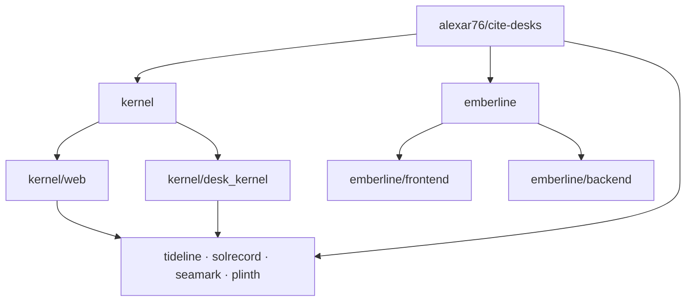
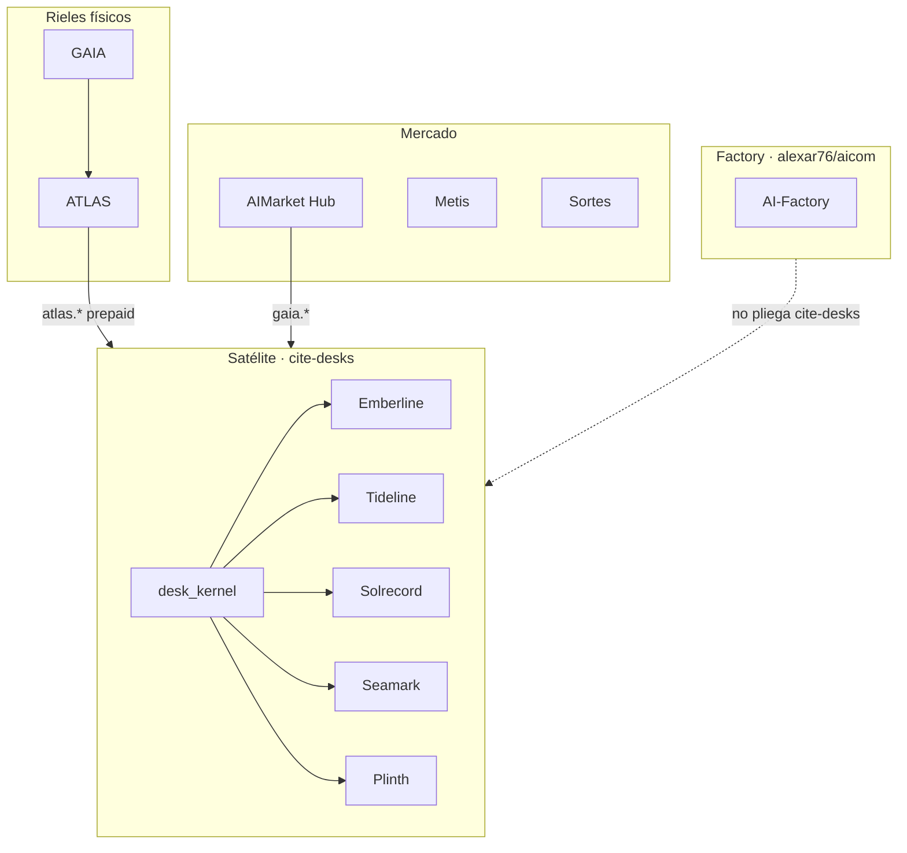

# Cite Desks

<p align="center">
  <strong>CITE DESKS</strong> — escritorios de evidencia independientes sobre rieles AIMarket<br/>
  Parte de la economía de agentes <a href="https://github.com/alexar76">alexar76</a> · <strong>no</strong> es una marca AIMarket
</p>

<p align="center">
  <a href="https://desk.modelmarket.dev/">
    
  </a>
  <br>
  <sub>Evidencia que se puede citar — no perímetros, pronósticos ni scores inventados. — <a href="https://desk.modelmarket.dev/"><b>landing de familia →</b></a> · <a href="https://emberlinedesk.com/"><b>demo Emberline →</b></a></sub>
</p>

<p align="center">
  <strong><a href="https://desk.modelmarket.dev/">Landing de familia</a></strong>
  ·
  <strong><a href="https://emberlinedesk.com/">Emberline</a></strong>
  ·
  <strong><a href="https://atlas.modelmarket.dev/">ATLAS</a></strong>
  ·
  <strong><a href="https://iot.modelmarket.dev/">GAIA</a></strong>
</p>

> 🌐 [English](README.md) · [Русский](README.ru.md) · **Español** · [Français](README.fr.md) · [中文](README.zh.md) · [Glosario](https://github.com/alexar76/aicom/blob/main/docs/localization-glossary.md)

**Un satélite padre** (`alexar76/cite-desks`): [`kernel/`](kernel/) compartido y cinco escritorios anidados — cada uno con origen, franja legal y clase de afirmación propios. **Fuera** del factory recortado [`alexar76/aicom`](https://github.com/alexar76/aicom).

## Galería de escritorios

<table>
  <tr>
    <td width="50%"><a href="emberline/README.md"></a><br/><sub><b><a href="emberline/README.md">Emberline</a></b> — fuego · <a href="https://emberlinedesk.com/">live</a></sub></td>
    <td width="50%"><a href="tideline/README.md"></a><br/><sub><b><a href="tideline/README.md">Tideline</a></b> — inundación · <a href="https://tideline.modelmarket.dev/">live</a></sub></td>
  </tr>
  <tr>
    <td><a href="solrecord/README.md"></a><br/><sub><b><a href="solrecord/README.md">Solrecord</a></b> — PV · <a href="https://solrecord.modelmarket.dev/">live</a></sub></td>
    <td><a href="seamark/README.md"></a><br/><sub><b><a href="seamark/README.md">Seamark</a></b> — AIS nórdico · <a href="https://seamark.modelmarket.dev/">live</a></sub></td>
  </tr>
  <tr>
    <td><a href="plinth/README.md"></a><br/><sub><b><a href="plinth/README.md">Plinth</a></b> — sitio · <a href="https://plinth.modelmarket.dev/">live</a></sub></td>
    <td><a href="kernel/README.md"><sub><b><a href="kernel/README.md">Kernel</a></b> — rail compartido (sin live)</sub></a></td>
  </tr>
</table>


| Escritorio | Afirmación | Live / intended | README |
|------------|------------|-----------------|--------|
| **[Emberline](emberline/)** — fuego | Puntos FIRMS/EFFIS + clima acotado. No perímetro. | [emberlinedesk.com](https://emberlinedesk.com) | [README](emberline/README.md) |
| **[Tideline](tideline/)** — inundación | Aviso CAP **y** sensor in situ, **dos listas**. No modelo de crecida. | [tideline.modelmarket.dev](https://tideline.modelmarket.dev/) | [README](tideline/README.md) |
| **[Solrecord](solrecord/)** — PV | Irradiancia retrospectiva en un **pin de planta**. No pronóstico de yield. | [solrecord.modelmarket.dev](https://solrecord.modelmarket.dev/) | [README](solrecord/README.md) |
| **[Seamark](seamark/)** — AIS nórdico | Fintraffic + Kystverket, **dos listas**. No AIS global. | [seamark.modelmarket.dev](https://seamark.modelmarket.dev/) | [README](seamark/README.md) |
| **[Plinth](plinth/)** — sitio | Nowcast de sede / colo; clima, aire, agua en **listas separadas**. No BMS. | [plinth.modelmarket.dev](https://plinth.modelmarket.dev/) | [README](plinth/README.md) |
| **[Kernel](kernel/)** | Custody, facturas USDC + settlement, cite packs, webhooks | — | [README](kernel/README.md) |

Locale ≠ ampliación de licencia: [`docs/LOCALES-AND-PLACEMENT.md`](docs/LOCALES-AND-PLACEMENT.md). El humo es una **capa** de Emberline, no un subdominio.

## Arquitectura

Un satélite padre. Emberline es un árbol de producto completo. Los otros cuatro escritorios son marca + compose + `DESK_ID`; el código ejecutable vive en el kernel compartido.



- **Emberline** — sitio y API propios: [`emberline/frontend/`](emberline/frontend/), [`emberline/backend/`](emberline/backend/). Compose: [`emberline/docker-compose.yml`](emberline/docker-compose.yml).
- **Tideline / Solrecord / Seamark / Plinth** — marca, docs, compose y `DESK_ID`. Compose construye la API desde [`kernel/Dockerfile`](kernel/Dockerfile) y sirve [`kernel/web/`](https://github.com/alexar76/cite-desks/tree/main/kernel/web); Python: [`kernel/desk_kernel/`](https://github.com/alexar76/cite-desks/tree/main/kernel/desk_kernel). Ejemplo: [`plinth/docker-compose.yml`](plinth/docker-compose.yml) → `DESK_ID=plinth`.
- **`*/backend` y `*/frontend` en esos cuatro** — punteros al kernel, **no** copias de Emberline ([`plinth/backend/`](plinth/backend/), [`plinth/frontend/`](plinth/frontend/)).

## Lugar en el ecosistema

Los escritorios son **clientes del Hub**, no un segundo Hub. Compran SKUs atestados `atlas.*` / `gaia.*`, archivan un cite pack y cobran al comprador en USDC en Base.



Metis es un analista opcional en otra parte de la economía; Sortes es una clase oracle de aleatoriedad verificable — no suministro del escritorio.

| Proyecto | Relación |
|----------|----------|
| **[AICOM](https://github.com/alexar76/aicom)** | El factory **no** embebe `cite-desks/` |
| **[GAIA](https://github.com/alexar76/gaia)** / **[ATLAS](https://github.com/alexar76/atlas)** | Suministro de evidencia |
| **[Hub](https://github.com/alexar76/aimarket-hub)** | Catálogo federado para `gaia.*` |
| **[Metis](https://github.com/alexar76/metis)** / **Sortes** | Otras clases; no el checkout del escritorio |

## Economía (dos rieles)

### Riel 1 — comprador → escritorio (USDC en Base)

Sin persona en el bucle ([kernel](kernel/README.md#checkout-nobody-in-the-loop)): quote → transferencia USDC → poll/`settle()` → **exactamente una** desk key → redeem.

| Plan | USD | Watches | Runs | Retención |
|------|-----|---------|------|-----------|
| Solo | 49 | 2 | 200 | 30d |
| Team | 149 | 10 | 1000 | 90d |
| Desk | 499 | 50 | 5000 | 365d |

Sin `PAY_BASE_ADDRESS` real → checkout **cerrado**; en production **no arranca**. El demo [desk.modelmarket.dev](https://desk.modelmarket.dev) **no se vende**.

### Riel 2 — escritorio → vendedores

- ATLAS: `HUB_URL` + `HUB_API_KEY` → `atlas.*` (prepago, no 5/h anónimas)
- GAIA: `GAIA_HUB_URL` + `GAIA_HUB_API_KEY` → `gaia.*` (ambos o ninguno)

Sin saldo → fallo honesto; la cuota del plan no se consume; los rechazos no se facturan. Health: `/api/public/health`.

## Local / casos de despliegue

Flags de [`deploy.sh`](deploy.sh): `--list`, `--test`, `--build`, `--prod`. Compose por escritorio. Sin `--prod` en Metis se aplica `docker-compose.metis.yml`.

| Caso | Cómo |
|------|------|
| **Solo Emberline** | `./deploy.sh emberline` — [`emberline/docker-compose.yml`](emberline/docker-compose.yml) (frontend/backend propios). Merchant: `--prod`. Demo Metis: auto `docker-compose.metis.yml`. |
| **Un escritorio kernel** | `./deploy.sh tideline --build` — compose del desk + `DESK_ID` + imágenes de `kernel/`. Igual solrecord / seamark / plinth. |
| **Varios escritorios kernel** | Repetir `./deploy.sh <desk> --build`; kernel compartido, DB/`DESK_ID`/host distintos. En Metis: `metisnet` + [`deploy/nginx.desks.conf`](deploy/nginx.desks.conf). |
| **Solo landing de familia** | Sync [`docs/landing/`](docs/landing/) → `/var/www/metis-landing/cite-desks`; vhost `desk.modelmarket.dev`. Sin `./deploy.sh <desk>`. |
| **Stack Metis completo** | Landing + nginx conf + `./deploy.sh` para emberline y siblings sin `--prod`. |

```bash
./deploy.sh --list
./deploy.sh emberline
./deploy.sh tideline --build
```

Texto EN completo: [README.md](README.md).
