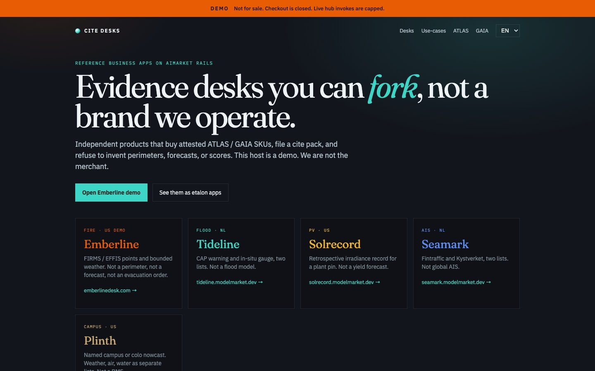
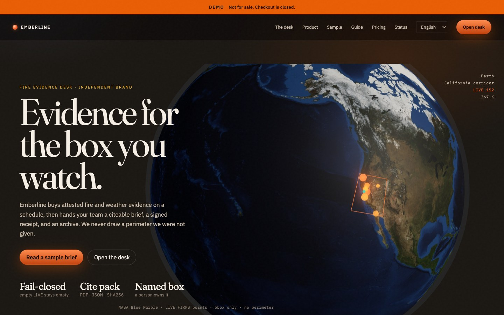
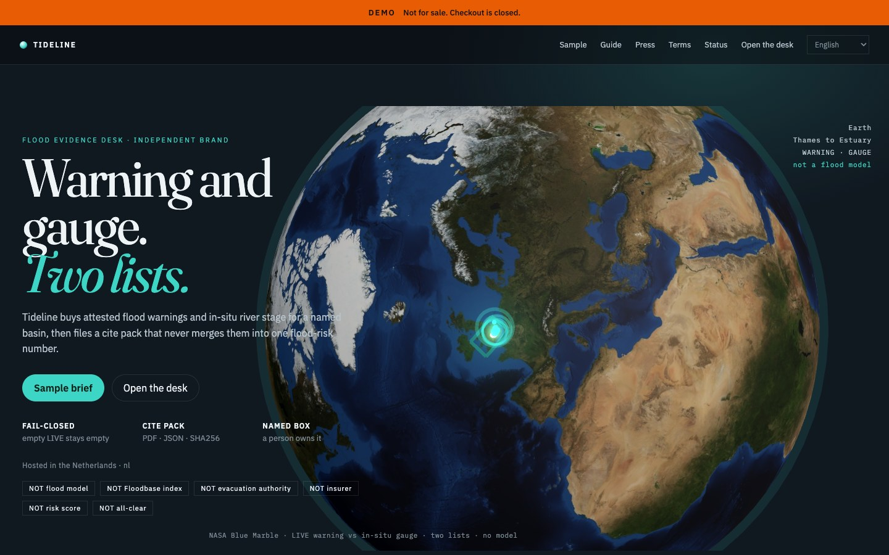
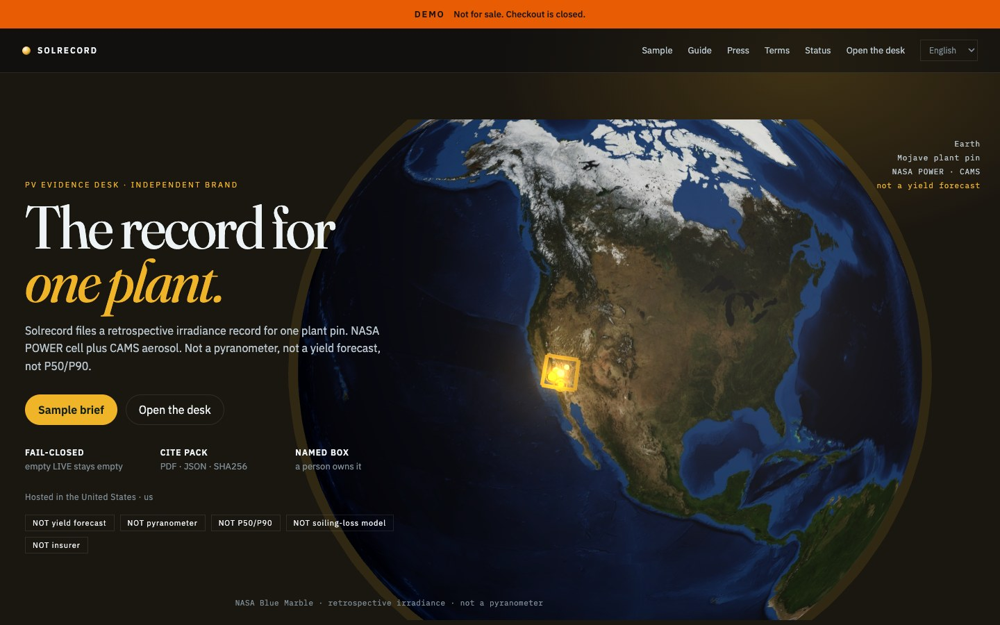
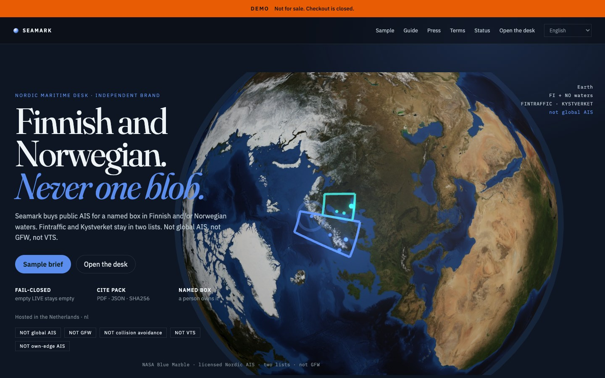
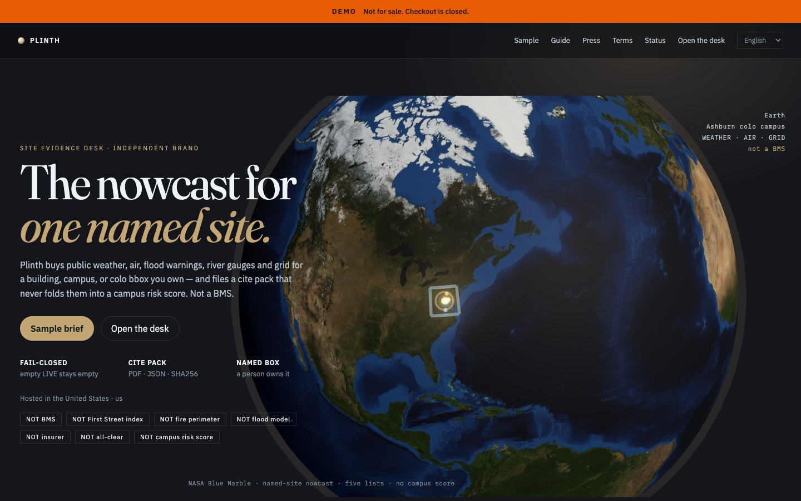
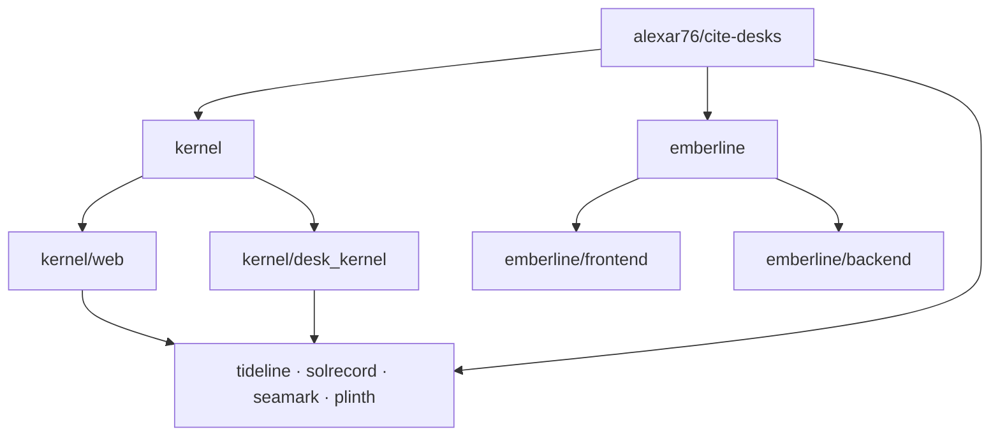
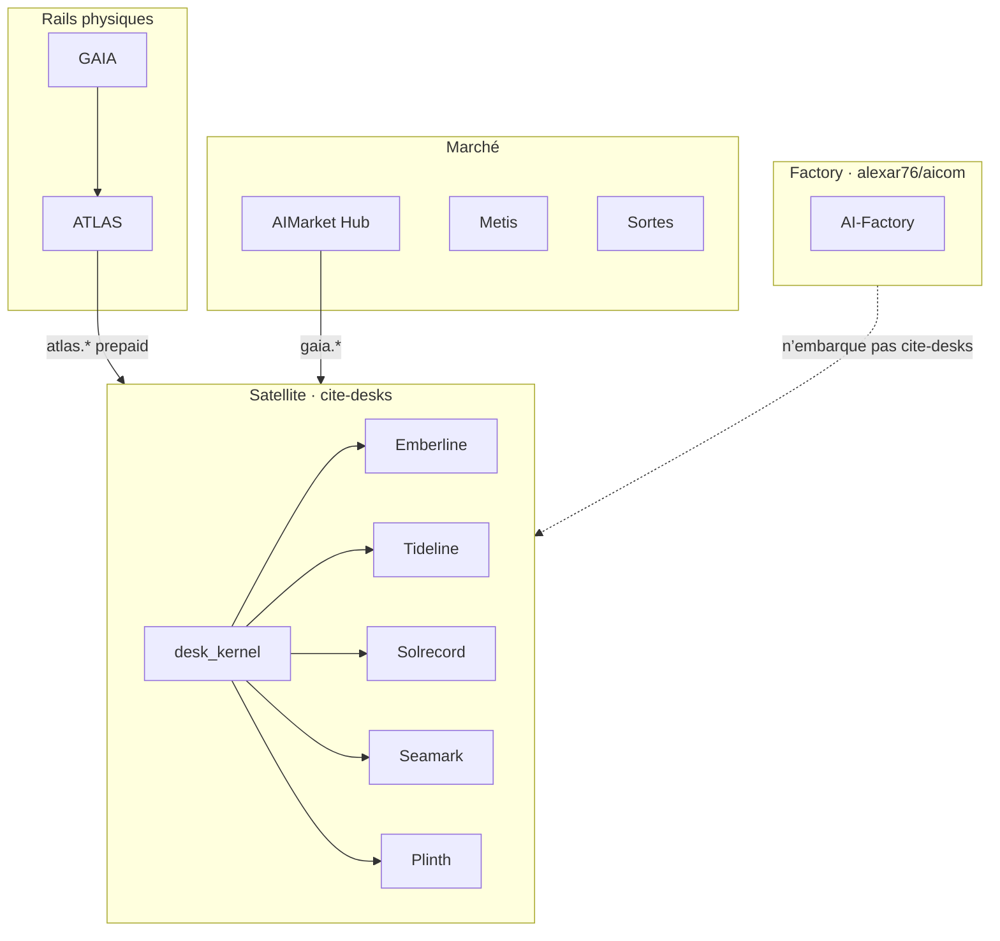

# Cite Desks

<p align="center">
  <strong>CITE DESKS</strong> — bureaux de preuve indépendants sur les rails AIMarket<br/>
  Partie de l’économie d’agents <a href="https://github.com/alexar76">alexar76</a> · <strong>pas</strong> une marque AIMarket
</p>

<p align="center">
  <a href="https://desk.modelmarket.dev/">
    
  </a>
  <br>
  <sub>Des preuves que l’on peut citer — pas des périmètres, prévisions ou scores inventés. — <a href="https://desk.modelmarket.dev/"><b>landing famille →</b></a> · <a href="https://emberlinedesk.com/"><b>démo Emberline →</b></a></sub>
</p>

<p align="center">
  <strong><a href="https://desk.modelmarket.dev/">Landing famille</a></strong>
  ·
  <strong><a href="https://emberlinedesk.com/">Emberline</a></strong>
  ·
  <strong><a href="https://atlas.modelmarket.dev/">ATLAS</a></strong>
  ·
  <strong><a href="https://iot.modelmarket.dev/">GAIA</a></strong>
</p>

> 🌐 [English](README.md) · [Русский](README.ru.md) · [Español](README.es.md) · **Français** · [中文](README.zh.md) · [Glossaire](https://github.com/alexar76/aicom/blob/main/docs/localization-glossary.md)

**Un satellite parent** (`alexar76/cite-desks`) : [`kernel/`](kernel/) partagé et cinq bureaux imbriqués — chacun avec son origine, bandeau légal et classe d’affirmation. **Hors** du factory tronqué [`alexar76/aicom`](https://github.com/alexar76/aicom).

## Galerie des bureaux

<table>
  <tr>
    <td width="50%"><a href="emberline/README.md"></a><br/><sub><b><a href="emberline/README.md">Emberline</a></b> — feu · <a href="https://emberlinedesk.com/">live</a></sub></td>
    <td width="50%"><a href="tideline/README.md"></a><br/><sub><b><a href="tideline/README.md">Tideline</a></b> — crue · <a href="https://tideline.modelmarket.dev/">live</a></sub></td>
  </tr>
  <tr>
    <td><a href="solrecord/README.md"></a><br/><sub><b><a href="solrecord/README.md">Solrecord</a></b> — PV · <a href="https://solrecord.modelmarket.dev/">live</a></sub></td>
    <td><a href="seamark/README.md"></a><br/><sub><b><a href="seamark/README.md">Seamark</a></b> — AIS nordique · <a href="https://seamark.modelmarket.dev/">live</a></sub></td>
  </tr>
  <tr>
    <td><a href="plinth/README.md"></a><br/><sub><b><a href="plinth/README.md">Plinth</a></b> — site · <a href="https://plinth.modelmarket.dev/">live</a></sub></td>
    <td><a href="kernel/README.md"><sub><b><a href="kernel/README.md">Kernel</a></b> — rail partagé (pas de live)</sub></a></td>
  </tr>
</table>


| Bureau | Affirmation | Live / intended | README |
|--------|-------------|-----------------|--------|
| **[Emberline](emberline/)** — feu | Points FIRMS/EFFIS + météo bornée. Pas un périmètre. | [emberlinedesk.com](https://emberlinedesk.com) | [README](emberline/README.md) |
| **[Tideline](tideline/)** — crue | Alerte CAP **et** jauge in situ, **deux listes**. Pas un modèle de crue. | [tideline.modelmarket.dev](https://tideline.modelmarket.dev/) | [README](tideline/README.md) |
| **[Solrecord](solrecord/)** — PV | Irradiance rétrospective d’un **pin de centrale**. Pas un yield forecast. | [solrecord.modelmarket.dev](https://solrecord.modelmarket.dev/) | [README](solrecord/README.md) |
| **[Seamark](seamark/)** — AIS nordique | Fintraffic + Kystverket, **deux listes**. Pas l’AIS mondial. | [seamark.modelmarket.dev](https://seamark.modelmarket.dev/) | [README](seamark/README.md) |
| **[Plinth](plinth/)** — site | Nowcast site / colo ; météo, air, eau en **listes séparées**. Pas un BMS. | [plinth.modelmarket.dev](https://plinth.modelmarket.dev/) | [README](plinth/README.md) |
| **[Kernel](kernel/)** | Custody, factures USDC + settlement, cite packs, webhooks | — | [README](kernel/README.md) |

Locale ≠ extension de licence : [`docs/LOCALES-AND-PLACEMENT.md`](docs/LOCALES-AND-PLACEMENT.md). La fumée est une **couche** Emberline, pas un sous-domaine.

## Architecture

Un satellite parent. Emberline est un arbre produit complet. Les quatre autres bureaux sont marque + compose + `DESK_ID` ; le code exécutable est dans le kernel partagé.



- **Emberline** — site et API propres : [`emberline/frontend/`](emberline/frontend/), [`emberline/backend/`](emberline/backend/). Compose : [`emberline/docker-compose.yml`](emberline/docker-compose.yml).
- **Tideline / Solrecord / Seamark / Plinth** — marque, docs, compose et `DESK_ID`. Compose construit l’API depuis [`kernel/Dockerfile`](kernel/Dockerfile) et sert [`kernel/web/`](https://github.com/alexar76/cite-desks/tree/main/kernel/web) ; Python : [`kernel/desk_kernel/`](https://github.com/alexar76/cite-desks/tree/main/kernel/desk_kernel). Exemple : [`plinth/docker-compose.yml`](plinth/docker-compose.yml) → `DESK_ID=plinth`.
- **`*/backend` et `*/frontend` de ces quatre** — pointeurs vers le kernel, **pas** des copies d’Emberline ([`plinth/backend/`](plinth/backend/), [`plinth/frontend/`](plinth/frontend/)).

## Place dans l’écosystème

Les bureaux sont des **clients du Hub**, pas un second Hub. Ils achètent des SKU attestés `atlas.*` / `gaia.*`, classent un cite pack, et encaissent le client en USDC sur Base.



Metis est un analyste optionnel ailleurs dans l’économie ; Sortes est une classe d’oracle à aléatoire vérifiable — pas l’approvisionnement du bureau.

| Projet | Lien |
|--------|------|
| **[AICOM](https://github.com/alexar76/aicom)** | Le factory **n’embarque pas** `cite-desks/` |
| **[GAIA](https://github.com/alexar76/gaia)** / **[ATLAS](https://github.com/alexar76/atlas)** | Fourniture d’évidence |
| **[Hub](https://github.com/alexar76/aimarket-hub)** | Catalogue fédéré pour `gaia.*` |
| **[Metis](https://github.com/alexar76/metis)** / **Sortes** | Autres classes ; pas le checkout du bureau |

## Économie (deux rails)

### Rail 1 — acheteur → bureau (USDC sur Base)

Sans humain dans la boucle ([kernel](kernel/README.md#checkout-nobody-in-the-loop)) : quote → transfert USDC → poll/`settle()` → **exactement une** desk key → redeem.

| Plan | USD | Watches | Runs | Rétention |
|------|-----|---------|------|-----------|
| Solo | 49 | 2 | 200 | 30j |
| Team | 149 | 10 | 1000 | 90j |
| Desk | 499 | 50 | 5000 | 365j |

Sans vrai `PAY_BASE_ADDRESS` → checkout **fermé** ; en production le bureau **refuse de démarrer**. La démo [desk.modelmarket.dev](https://desk.modelmarket.dev) **n’est pas à vendre**.

### Rail 2 — bureau → vendeurs

- ATLAS : `HUB_URL` + `HUB_API_KEY` → `atlas.*` (prépayé, pas 5/h anonymes)
- GAIA : `GAIA_HUB_URL` + `GAIA_HUB_API_KEY` → `gaia.*` (les deux ou rien)

Solde épuisé → échec honnête ; le quota du plan n’est pas brûlé ; les refus ne sont pas facturés. Health : `/api/public/health`.

## Local / cas de déploiement

Flags de [`deploy.sh`](deploy.sh) : `--list`, `--test`, `--build`, `--prod`. Compose par bureau. Sans `--prod` sur Metis, `docker-compose.metis.yml` s’applique.

| Cas | Comment |
|-----|---------|
| **Emberline seul** | `./deploy.sh emberline` — [`emberline/docker-compose.yml`](emberline/docker-compose.yml) (frontend/backend propres). Merchant : `--prod`. Démo Metis : auto `docker-compose.metis.yml`. |
| **Un bureau kernel** | `./deploy.sh tideline --build` — compose du desk + `DESK_ID` + images `kernel/`. Idem solrecord / seamark / plinth. |
| **Plusieurs bureaux kernel** | Répéter `./deploy.sh <desk> --build` ; kernel partagé, DB/`DESK_ID`/hôte distincts. Sur Metis : `metisnet` + [`deploy/nginx.desks.conf`](deploy/nginx.desks.conf). |
| **Landing famille seul** | Sync [`docs/landing/`](docs/landing/) → `/var/www/metis-landing/cite-desks` ; vhost `desk.modelmarket.dev`. Pas de `./deploy.sh <desk>`. |
| **Stack Metis complet** | Landing + conf nginx + `./deploy.sh` pour emberline et siblings sans `--prod`. |

```bash
./deploy.sh --list
./deploy.sh emberline
./deploy.sh tideline --build
```

Texte EN complet : [README.md](README.md).
