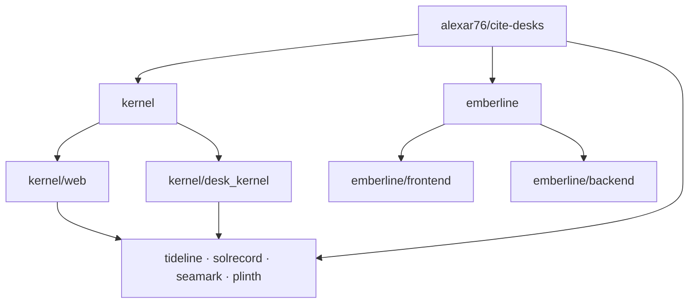
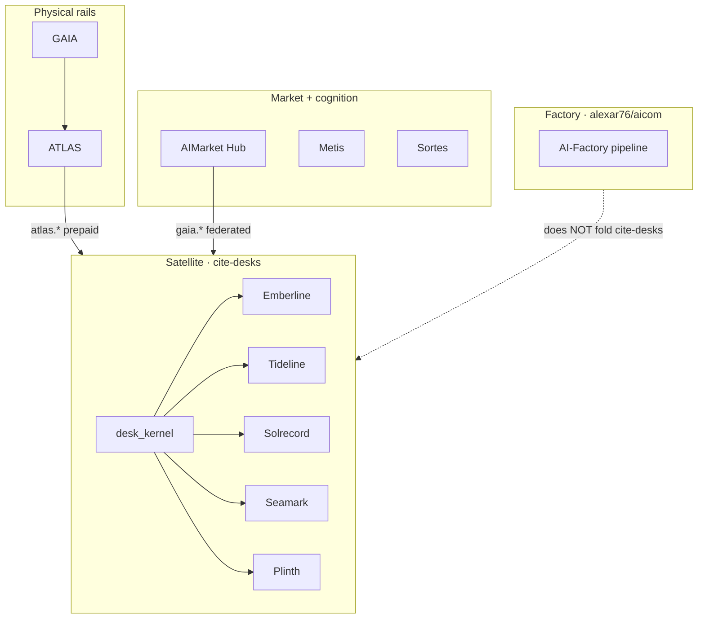

<!-- aicom-mirror-notice -->
> **📖 Read-only mirror.** `cite-desks` is published from the canonical AI-Factory monorepo.
> **Pull requests are not accepted** — any commit pushed here is overwritten by
> `scripts/mirror_satellites.sh` on the next sync.
> 🐞 Found a bug or have a request? Please **[open an issue](https://github.com/alexar76/cite-desks/issues)**.

# Cite Desks

<!-- aicom-readme-badges -->
<p align="center">
  <a href="https://desk.modelmarket.dev/"></a>
  <a href="https://emberlinedesk.com/"></a>
  
  
  <a href="emberline/LICENSE"></a>
</p>
<!-- /aicom-readme-badges -->

<p align="center">
  <strong>CITE DESKS</strong> — independent evidence desks on AIMarket rails<br/>
  Part of the <a href="https://github.com/alexar76">alexar76</a> AI agent economy · <strong>not</strong> an AIMarket brand surface
</p>

<p align="center">
  <a href="https://desk.modelmarket.dev/">
    
  </a>
  <br>
  <sub>Evidence you can cite — not perimeters, forecasts, or scores we invent. — <a href="https://desk.modelmarket.dev/"><b>family landing →</b></a> · <a href="https://emberlinedesk.com/"><b>Emberline demo →</b></a></sub>
</p>

<p align="center">
  <strong><a href="https://desk.modelmarket.dev/">Family landing</a></strong>
  ·
  <strong><a href="https://emberlinedesk.com/">Emberline</a></strong>
  ·
  <strong><a href="https://use.modelmarket.dev/">Use-cases</a></strong>
  ·
  <strong><a href="https://atlas.modelmarket.dev/">ATLAS</a></strong>
  ·
  <strong><a href="https://iot.modelmarket.dev/">GAIA</a></strong>
</p>

> 🌐 **English** · [Русский](README.ru.md) · [Español](README.es.md) · [Français](README.fr.md) · [中文](README.zh.md) · [Glossary](https://github.com/alexar76/aicom/blob/main/docs/localization-glossary.md)

**One parent satellite** (`alexar76/cite-desks`): shared [`kernel/`](kernel/) plus five nested desks, each with its own origin, legal strip, and claim class. Still **excluded** from the trimmed factory [`alexar76/aicom`](https://github.com/alexar76/aicom) — nested desks are not separate top-level GitHub repos.

## Desk gallery

<table>
  <tr>
    <td width="50%"><a href="emberline/README.md"></a><br/><sub><b><a href="emberline/README.md">Emberline</a></b> — fire · <a href="https://emberlinedesk.com/">live</a></sub></td>
    <td width="50%"><a href="tideline/README.md"></a><br/><sub><b><a href="tideline/README.md">Tideline</a></b> — flood · <a href="https://tideline.modelmarket.dev/">live</a></sub></td>
  </tr>
  <tr>
    <td><a href="solrecord/README.md"></a><br/><sub><b><a href="solrecord/README.md">Solrecord</a></b> — PV · <a href="https://solrecord.modelmarket.dev/">live</a></sub></td>
    <td><a href="seamark/README.md"></a><br/><sub><b><a href="seamark/README.md">Seamark</a></b> — Nordic AIS · <a href="https://seamark.modelmarket.dev/">live</a></sub></td>
  </tr>
  <tr>
    <td><a href="plinth/README.md"></a><br/><sub><b><a href="plinth/README.md">Plinth</a></b> — site · <a href="https://plinth.modelmarket.dev/">live</a></sub></td>
    <td><a href="kernel/README.md"><sub><b><a href="kernel/README.md">Kernel</a></b> — shared rail (no live origin)</sub></a></td>
  </tr>
</table>


| Desk | Claim | Live / intended | README |
|------|--------|-----------------|--------|
| **[Emberline](emberline/)** — Fire | FIRMS/EFFIS **points** + bounded weather. Not a perimeter. | [emberlinedesk.com](https://emberlinedesk.com) | [emberline/README.md](emberline/README.md) |
| **[Tideline](tideline/)** — Flood | CAP warning **and** in-situ gauge, **two lists**. Not a flood model. | [tideline.modelmarket.dev](https://tideline.modelmarket.dev/) · [tidelinedesk.com](https://tidelinedesk.com) | [tideline/README.md](tideline/README.md) |
| **[Solrecord](solrecord/)** — PV | Retrospective irradiance at a **plant pin**. Not a yield forecast. | [solrecord.modelmarket.dev](https://solrecord.modelmarket.dev/) · [solrecorddesk.com](https://solrecorddesk.com) | [solrecord/README.md](solrecord/README.md) |
| **[Seamark](seamark/)** — Nordic AIS | Fintraffic + Kystverket, **two lists**. Not global AIS. | [seamark.modelmarket.dev](https://seamark.modelmarket.dev/) · [seamarkdesk.com](https://seamarkdesk.com) | [seamark/README.md](seamark/README.md) |
| **[Plinth](plinth/)** — Site | Named campus/colo nowcast; weather, air, water as **separate lists**. Not a BMS. | [plinth.modelmarket.dev](https://plinth.modelmarket.dev/) · [plinthdesk.com](https://plinthdesk.com) | [plinth/README.md](plinth/README.md) |
| **[Kernel](kernel/)** — shared rail | Hub custody, USDC salt invoices + settlement, cite packs, webhooks, FastAPI runtime | — | [kernel/README.md](kernel/README.md) |

Sibling kernel desks share `kernel/web` (`/sample` `/press` `/legal` `/status`). Emberline keeps its own React globe. Smoke is an Emberline **layer**, not a subdomain. Locale ≠ licence expansion: [`docs/LOCALES-AND-PLACEMENT.md`](docs/LOCALES-AND-PLACEMENT.md).

### Why not `*.emberlinedesk.com`

Emberline’s brand and outreach are fire-specific. Putting flood or AIS under Emberline would mix claim classes and fail intake. The kernel is shared. The **origin is not**.

## Architecture

One parent satellite. Emberline is a full product tree. The other four desks are brand + compose + `DESK_ID`; runnable code lives in the shared kernel.



- **Emberline** — own site and API: [`emberline/frontend/`](emberline/frontend/) and [`emberline/backend/`](emberline/backend/). Compose builds those trees ([`emberline/docker-compose.yml`](emberline/docker-compose.yml)).
- **Tideline / Solrecord / Seamark / Plinth** — brand, docs, compose, and `DESK_ID` only. Compose builds API from [`kernel/Dockerfile`](kernel/Dockerfile) and serves [`kernel/web/`](https://github.com/alexar76/cite-desks/tree/main/kernel/web); Python is [`kernel/desk_kernel/`](https://github.com/alexar76/cite-desks/tree/main/kernel/desk_kernel) (`uvicorn desk_kernel.service.main:app`). Example: [`plinth/docker-compose.yml`](plinth/docker-compose.yml) sets `DESK_ID=plinth`.
- **`*/backend` and `*/frontend` under those four desks** — pointer READMEs to the kernel paths above, **not** copies of Emberline (e.g. [`plinth/backend/`](plinth/backend/), [`plinth/frontend/`](plinth/frontend/)).

## Ecosystem place

Cite desks are **Hub clients**, not a second Hub. They buy attested `atlas.*` / `gaia.*` SKUs, file a cite pack, and settle customer access in USDC on Base when operated for real.



Metis is an optional analyst elsewhere in the economy; Sortes is a verifiable-randomness oracle class — neither is desk supply.

| Project | Relation to desks |
|---------|-------------------|
| **[AICOM factory](https://github.com/alexar76/aicom)** | Ships the ecosystem; **does not** embed `cite-desks/` in the public factory tree |
| **[GAIA](https://github.com/alexar76/gaia)** | Sensor relays / `gaia.*` capabilities desks purchase |
| **[ATLAS](https://github.com/alexar76/atlas)** | Watchbox / situation / fire / PV map products (`atlas.*`) |
| **[Hub](https://github.com/alexar76/aimarket-hub)** | Federated catalog; desks use it when buying federated `gaia.*` |
| **[Metis](https://github.com/alexar76/metis)** | Cognitive layer elsewhere in the economy — not the desk checkout |
| **Sortes** | Verifiable-randomness oracle class — not desk supply |

## Economics (two rails)

Honest split: **customers pay the desk**; the **desk pays ATLAS/GAIA** for evidence. Mixing them is how you sell a plan that dies after five anonymous Hub calls.

### Rail 1 — buyer → desk (USDC on Base)

Self-serve checkout, nobody in the loop ([kernel checkout](kernel/README.md#checkout-nobody-in-the-loop)):

1. Buyer `POST /api/public/pay/invoices` → unique micro-amount quote  
2. Wallet sends **USDC on Base** to `PAY_BASE_ADDRESS`  
3. Desk poll (`scan_payments` / optional tx-hash confirm) → `settle()` mints **exactly one** desk key  
4. Web shell redeems the key (`POST /api/auth/redeem`)

Plans (from `desk_kernel` / Emberline `plans.py`):

| Plan | USD | Watches | Runs | Retention |
|------|-----|---------|------|-----------|
| Solo | 49 | 2 | 200 | 30d |
| Team | 149 | 10 | 1000 | 90d |
| Desk | 499 | 50 | 5000 | 365d |

Fail-closed: no real treasury / placeholder `PAY_BASE_ADDRESS` → checkout **closed** (`503`); production **refuses to boot**. Family demo host ([desk.modelmarket.dev](https://desk.modelmarket.dev)) is explicitly **not for sale** — checkout closed, live Hub invokes capped.

### Rail 2 — desk → evidence sellers

| Upstream | Env | What it buys |
|----------|-----|--------------|
| ATLAS | `HUB_URL` + `HUB_API_KEY` | `atlas.*` (watchbox, fire weather, situation, PV record, …) |
| Federated GAIA | `GAIA_HUB_URL` + `GAIA_HUB_API_KEY` | `gaia.*` (e.g. public AIS) — ATLAS answers `404` for those |

Prepaid ATLAS account (`X-API-Key`); credited calls are **not** on the anonymous 5/hour IP allowance. Both GAIA URL and key or neither — no silent fall-back to free tier. Supply exhaustion fails honestly: customer told the desk cannot buy evidence; the run does **not** burn plan quota; refusals are never billed.

Health surfaces: `/api/public/health` → `checkout.*`, `supply.credit`, `supply.last_failure`.

## Layout

```
cite-desks/                 ← GitHub satellite root (alexar76/cite-desks)
  kernel/                   desk_kernel + shared web shell
  emberline/                fire desk (React UI)
  tideline/ solrecord/ seamark/ plinth/
  deploy.sh                 family entry (rsync + compose)
  docs/landing/             family landing (desk.modelmarket.dev)
  .github/workflows/ci.yml  family CI (kernel · emberline api · web)
```

Rooted here on purpose: every desk imports `desk_kernel` via `../../kernel`. A repo rooted at `emberline/` leaves the kernel outside the checkout.

## Local

```bash
cd kernel && python -m pip install -e ".[dev]" && python -m pytest
cd emberline && make test-api
./deploy.sh --list
./deploy.sh --test
```

## Deploy use-cases

Family entry: [`deploy.sh`](deploy.sh). Flags that exist: `--list`, `--test`, `--build`, `--prod`. Compose stays per desk. Optional host-only `docker-compose.host.yml` (loopback behind nginx) is picked up automatically when present — keep it off repo syncs. Never bare `rsync --delete` over a desk folder. After `--prod`, require `checkout.open` + `settlement: scheduled` and a fresh `checkout.last_scan.age_seconds`.

### 1. Emberline alone

Own frontend + backend trees.

```bash
./deploy.sh emberline
# or: cd emberline && docker compose -f docker-compose.yml up --build -d
```

- Compose: [`emberline/docker-compose.yml`](emberline/docker-compose.yml) (builds `emberline/backend`, `emberline/frontend`)
- Merchant overlay: `./deploy.sh emberline --prod` → also [`emberline/docker-compose.prod.yml`](emberline/docker-compose.prod.yml)
- Metis public demo (no `--prod`): auto-adds [`emberline/docker-compose.metis.yml`](emberline/docker-compose.metis.yml) when that file exists (`DESK_MODE=demo`, `metisnet`)

### 2. One kernel desk alone

Example — only Tideline: that desk’s compose + shared kernel images + `DESK_ID` + host.

```bash
./deploy.sh tideline --build
# or: cd tideline && docker compose -f docker-compose.yml up --build -d
```

- Compose: [`tideline/docker-compose.yml`](tideline/docker-compose.yml) (`DESK_ID=tideline`; API from `kernel/Dockerfile`, web from `kernel/web/Dockerfile`)
- Same pattern for [`solrecord/`](solrecord/), [`seamark/`](seamark/), [`plinth/`](plinth/)
- Merchant: `./deploy.sh tideline --prod` → [`tideline/docker-compose.prod.yml`](tideline/docker-compose.prod.yml)
- Metis demo (no `--prod`): auto [`tideline/docker-compose.metis.yml`](tideline/docker-compose.metis.yml)

### 3. Several kernel desks together

Shared kernel source; each desk is its own compose project (own DB, `DESK_ID`, ports/host).

```bash
./deploy.sh tideline --build
./deploy.sh solrecord --build
./deploy.sh seamark --build
./deploy.sh plinth --build
```

On Metis, each metis overlay joins external `metisnet`; edge routing is [`deploy/nginx.desks.conf`](deploy/nginx.desks.conf) (append into host `metis-nginx`, do not replace the Metis conf).

### 4. Family landing alone

Static catalog only — no desk API.

- Sources: [`docs/landing/`](docs/landing/) (`index.html`, `sw.js`)
- Host docroot (Metis): `/var/www/metis-landing/cite-desks` → nginx `root` for `desk.modelmarket.dev` in [`deploy/nginx.desks.conf`](deploy/nginx.desks.conf)
- Sync the landing tree to that path; reload `metis-nginx`. No `./deploy.sh <desk>` required.

### 5. Full Metis stack (all desks + landing)

1. Sync [`docs/landing/`](docs/landing/) → `/var/www/metis-landing/cite-desks`
2. Ensure [`deploy/nginx.desks.conf`](deploy/nginx.desks.conf) is appended on the host nginx (desk + emberline + sibling vhosts)
3. Bring up each desk without `--prod` so `docker-compose.metis.yml` applies:

```bash
./deploy.sh emberline --build
./deploy.sh tideline --build
./deploy.sh solrecord --build
./deploy.sh seamark --build
./deploy.sh plinth --build
```

Demo overlays set `DESK_MODE=demo` (checkout closed), fixture Hub/pay, and loopback web ports; `metis-nginx` proxies via `*-web` on `metisnet`.

## Publish note

Satellite id `cite-desks` → `https://github.com/alexar76/cite-desks`. Mirror via `./scripts/publish_all_repos.sh --satellite cite-desks` (alexar76 + `GH_PAT`). First push of `.github/workflows/ci.yml` needs a PAT with **`workflow`** scope; `repo` + `write:packages` alone is enough for satellites whose workflows already exist on GitHub and did not change in that run.
