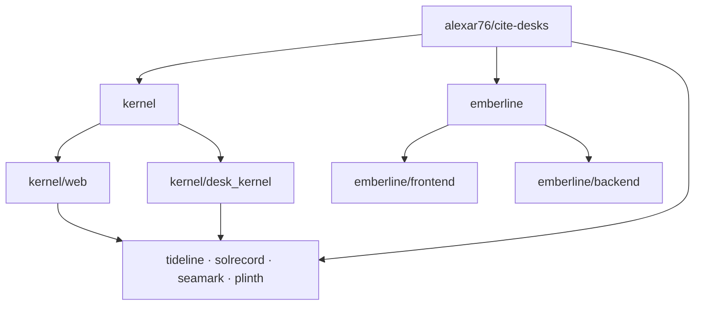
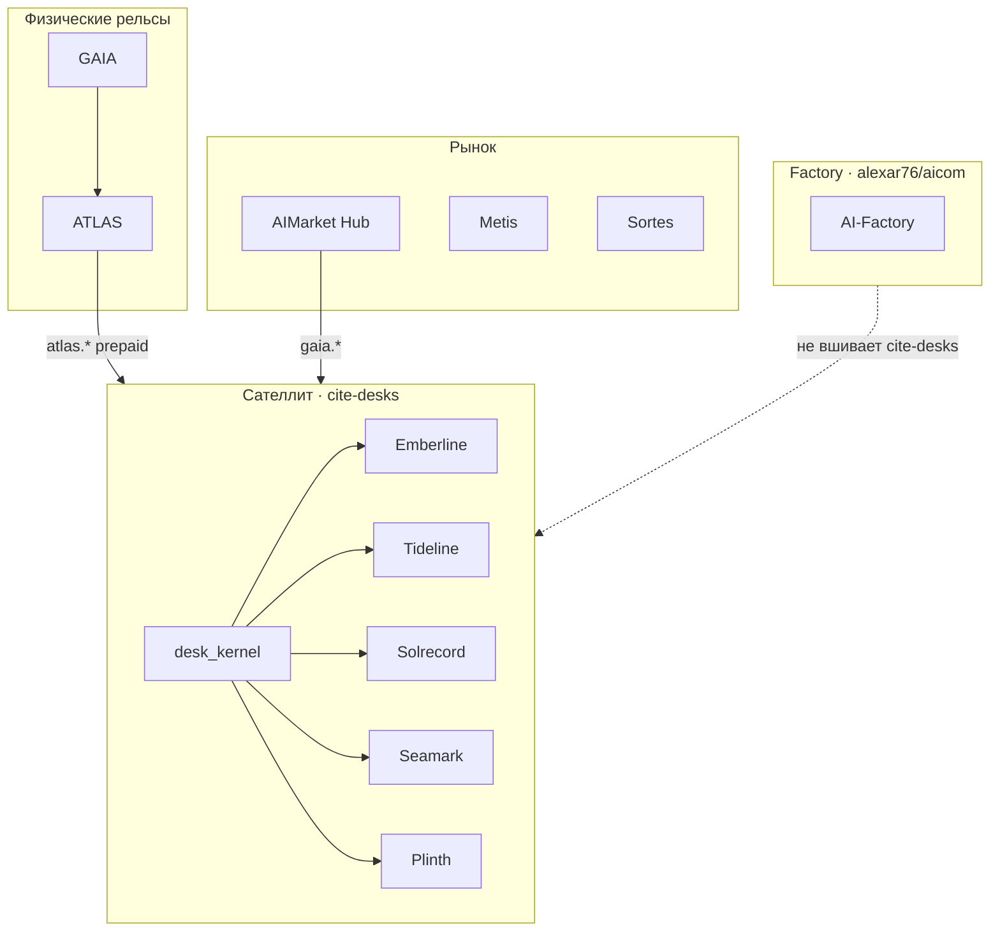

# Cite Desks

<p align="center">
  <strong>CITE DESKS</strong> — независимые evidence-столы на рельсах AIMarket<br/>
  Часть экономики агентов <a href="https://github.com/alexar76">alexar76</a> · <strong>не</strong> бренд-поверхность AIMarket
</p>

<p align="center">
  <a href="https://desk.modelmarket.dev/">
    
  </a>
  <br>
  <sub>Доказательства, которые можно цитировать — не периметры, прогнозы и скоры, которые мы выдумали. — <a href="https://desk.modelmarket.dev/"><b>семейный лендинг →</b></a> · <a href="https://emberlinedesk.com/"><b>демо Emberline →</b></a></sub>
</p>

<p align="center">
  <strong><a href="https://desk.modelmarket.dev/">Семейный лендинг</a></strong>
  ·
  <strong><a href="https://emberlinedesk.com/">Emberline</a></strong>
  ·
  <strong><a href="https://atlas.modelmarket.dev/">ATLAS</a></strong>
  ·
  <strong><a href="https://iot.modelmarket.dev/">GAIA</a></strong>
</p>

> 🌐 [English](README.md) · **Русский** · [Español](README.es.md) · [Français](README.fr.md) · [中文](README.zh.md) · [Глоссарий](https://github.com/alexar76/aicom/blob/main/docs/localization-glossary.md)

**Один родительский сателлит** (`alexar76/cite-desks`): общий [`kernel/`](kernel/) и пять вложенных столов — у каждого свой origin, legal strip и класс утверждений. **Не** входит в урезанный factory [`alexar76/aicom`](https://github.com/alexar76/aicom).

## Галерея столов

<table>
  <tr>
    <td width="50%"><a href="emberline/README.md"></a><br/><sub><b><a href="emberline/README.md">Emberline</a></b> — огонь · <a href="https://emberlinedesk.com/">live</a></sub></td>
    <td width="50%"><a href="tideline/README.md"></a><br/><sub><b><a href="tideline/README.md">Tideline</a></b> — паводок · <a href="https://tideline.modelmarket.dev/">live</a></sub></td>
  </tr>
  <tr>
    <td><a href="solrecord/README.md"></a><br/><sub><b><a href="solrecord/README.md">Solrecord</a></b> — PV · <a href="https://solrecord.modelmarket.dev/">live</a></sub></td>
    <td><a href="seamark/README.md"></a><br/><sub><b><a href="seamark/README.md">Seamark</a></b> — Nordic AIS · <a href="https://seamark.modelmarket.dev/">live</a></sub></td>
  </tr>
  <tr>
    <td><a href="plinth/README.md"></a><br/><sub><b><a href="plinth/README.md">Plinth</a></b> — площадка · <a href="https://plinth.modelmarket.dev/">live</a></sub></td>
    <td><a href="kernel/README.md"><sub><b><a href="kernel/README.md">Kernel</a></b> — общая рельса (без live)</sub></a></td>
  </tr>
</table>


| Стол | Утверждение | Live / intended | README |
|------|-------------|-----------------|--------|
| **[Emberline](emberline/)** — огонь | Точки FIRMS/EFFIS + ограниченная погода. Не периметр. | [emberlinedesk.com](https://emberlinedesk.com) | [README](emberline/README.md) |
| **[Tideline](tideline/)** — паводок | CAP-предупреждение **и** датчик, **два списка**. Не модель паводка. | [tideline.modelmarket.dev](https://tideline.modelmarket.dev/) | [README](tideline/README.md) |
| **[Solrecord](solrecord/)** — PV | Ретроспективная инсоляция **точки станции**. Не прогноз выработки. | [solrecord.modelmarket.dev](https://solrecord.modelmarket.dev/) | [README](solrecord/README.md) |
| **[Seamark](seamark/)** — Nordic AIS | Fintraffic + Kystverket, **два списка**. Не глобальный AIS. | [seamark.modelmarket.dev](https://seamark.modelmarket.dev/) | [README](seamark/README.md) |
| **[Plinth](plinth/)** — сайт | Nowcast площадки / colo; погода, воздух, вода — **разные списки**. Не BMS. | [plinth.modelmarket.dev](https://plinth.modelmarket.dev/) | [README](plinth/README.md) |
| **[Kernel](kernel/)** | Custody, USDC-инвойсы + settlement, cite packs, webhooks | — | [README](kernel/README.md) |

Локаль ≠ расширение лицензии: [`docs/LOCALES-AND-PLACEMENT.md`](docs/LOCALES-AND-PLACEMENT.md). Дым — **слой** Emberline, не поддомен.

## Архитектура

Один родительский сателлит. Emberline — полное дерево продукта. Остальные четыре стола — бренд + compose + `DESK_ID`; исполняемый код в общем kernel.



- **Emberline** — свой сайт и API: [`emberline/frontend/`](emberline/frontend/), [`emberline/backend/`](emberline/backend/). Compose: [`emberline/docker-compose.yml`](emberline/docker-compose.yml).
- **Tideline / Solrecord / Seamark / Plinth** — бренд, docs, compose и `DESK_ID`. Compose собирает API из [`kernel/Dockerfile`](kernel/Dockerfile) и отдаёт [`kernel/web/`](https://github.com/alexar76/cite-desks/tree/main/kernel/web); Python — [`kernel/desk_kernel/`](https://github.com/alexar76/cite-desks/tree/main/kernel/desk_kernel). Пример: [`plinth/docker-compose.yml`](plinth/docker-compose.yml) → `DESK_ID=plinth`.
- **`*/backend` и `*/frontend` у этих четырёх** — указатели на kernel, **не** копии Emberline ([`plinth/backend/`](plinth/backend/), [`plinth/frontend/`](plinth/frontend/)).

## Место в экосистеме

Столы — **клиенты Hub**, не второй Hub. Покупают attested SKU `atlas.*` / `gaia.*`, подшивают cite pack, принимают оплату покупателя в USDC на Base.



Metis — опциональный аналитик в другой части экономики; Sortes — класс verifiable-randomness oracle — не поставка стола.

| Проект | Связь |
|--------|--------|
| **[AICOM](https://github.com/alexar76/aicom)** | Factory **не** вкладывает `cite-desks/` в публичное дерево |
| **[GAIA](https://github.com/alexar76/gaia)** / **[ATLAS](https://github.com/alexar76/atlas)** | Поставка evidence |
| **[Hub](https://github.com/alexar76/aimarket-hub)** | Федеративный каталог для `gaia.*` |
| **[Metis](https://github.com/alexar76/metis)** / **Sortes** | Другие классы экономики, не checkout стола |

## Экономика (два рельса)

### Рельс 1 — покупатель → стол (USDC на Base)

Без человека в цикле ([kernel](kernel/README.md#checkout-nobody-in-the-loop)): quote → перевод USDC → poll/`settle()` → **ровно один** desk key → redeem.

| План | USD | Watches | Runs | Retention |
|------|-----|---------|------|-----------|
| Solo | 49 | 2 | 200 | 30д |
| Team | 149 | 10 | 1000 | 90д |
| Desk | 499 | 50 | 5000 | 365д |

Без настоящего `PAY_BASE_ADDRESS` касса **закрыта**; в production стол **не стартует**. Демо [desk.modelmarket.dev](https://desk.modelmarket.dev) — **не продаётся**.

### Рельс 2 — стол → продавцы evidence

- ATLAS: `HUB_URL` + `HUB_API_KEY` → `atlas.*` (prepaid, не анонимные 5/час)
- GAIA: `GAIA_HUB_URL` + `GAIA_HUB_API_KEY` → `gaia.*` (оба или ни одного)

Исчерпание баланса — честный отказ; квота плана не сгорает; отказы не биллятся. Health: `/api/public/health` → `checkout.*`, `supply.*`.

## Локально / юзкейсы деплоя

Флаги [`deploy.sh`](deploy.sh): `--list`, `--test`, `--build`, `--prod`. Compose — per desk. Без `--prod` на Metis подхватывается `docker-compose.metis.yml`.

| Юзкейс | Как |
|--------|-----|
| **Только Emberline** | `./deploy.sh emberline` — [`emberline/docker-compose.yml`](emberline/docker-compose.yml) (свой frontend/backend). Merchant: `--prod`. Демо Metis: auto `docker-compose.metis.yml`. |
| **Один kernel-стол** | `./deploy.sh tideline --build` — compose стола + `DESK_ID` + images из `kernel/`. То же для solrecord / seamark / plinth. |
| **Несколько kernel-столов** | Повторить `./deploy.sh <desk> --build` для каждого; общий kernel, разные DB/`DESK_ID`/хосты. На Metis — `metisnet` + [`deploy/nginx.desks.conf`](deploy/nginx.desks.conf). |
| **Только семейный лендинг** | Синк [`docs/landing/`](docs/landing/) → `/var/www/metis-landing/cite-desks`; vhost `desk.modelmarket.dev` в nginx conf. Без `./deploy.sh <desk>`. |
| **Полный стек Metis** | Лендинг + nginx conf + `./deploy.sh` для emberline и всех sibling без `--prod` (demo overlays). |

```bash
./deploy.sh --list
./deploy.sh emberline
./deploy.sh tideline --build
```

Полный EN-текст: [README.md](README.md).
