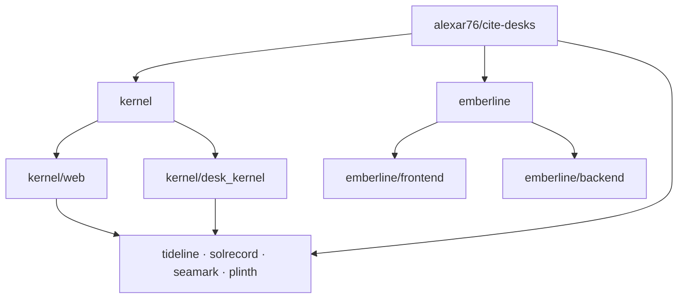
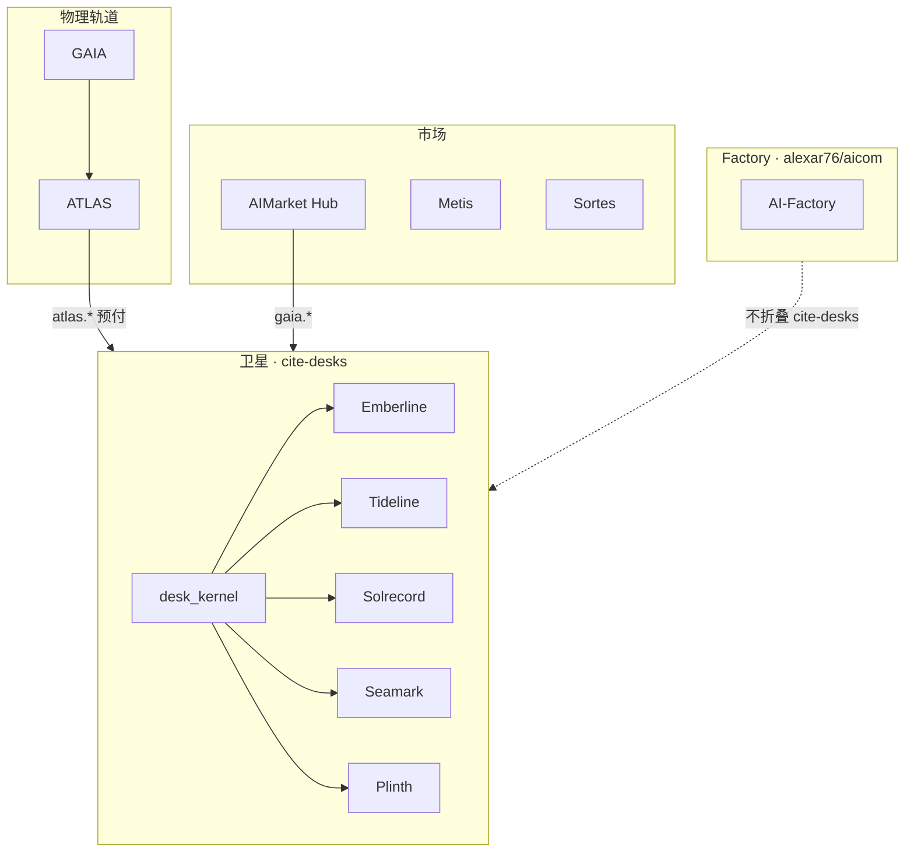

# Cite Desks

<p align="center">
  <strong>CITE DESKS</strong> — 基于 AIMarket 轨道的独立证据台<br/>
  属于 <a href="https://github.com/alexar76">alexar76</a> 智能体经济 · <strong>不是</strong> AIMarket 品牌表面
</p>

<p align="center">
  <a href="https://desk.modelmarket.dev/">
    
  </a>
  <br>
  <sub>可引用的证据 — 而非我们编造的周界、预报或评分。— <a href="https://desk.modelmarket.dev/"><b>家族落地页 →</b></a> · <a href="https://emberlinedesk.com/"><b>Emberline 演示 →</b></a></sub>
</p>

<p align="center">
  <strong><a href="https://desk.modelmarket.dev/">家族落地页</a></strong>
  ·
  <strong><a href="https://emberlinedesk.com/">Emberline</a></strong>
  ·
  <strong><a href="https://atlas.modelmarket.dev/">ATLAS</a></strong>
  ·
  <strong><a href="https://iot.modelmarket.dev/">GAIA</a></strong>
</p>

> 🌐 [English](README.md) · [Русский](README.ru.md) · [Español](README.es.md) · [Français](README.fr.md) · **中文** · [术语表](https://github.com/alexar76/aicom/blob/main/docs/localization-glossary.md)

**一个父级卫星仓**（`alexar76/cite-desks`）：共享 [`kernel/`](kernel/) 与五个嵌套证据台 — 各自有独立 origin、法律条与主张类别。**不**并入裁剪后的 factory [`alexar76/aicom`](https://github.com/alexar76/aicom)。

## 证据台画廊

<table>
  <tr>
    <td width="50%"><a href="emberline/README.md"></a><br/><sub><b><a href="emberline/README.md">Emberline</a></b> — 火 · <a href="https://emberlinedesk.com/">live</a></sub></td>
    <td width="50%"><a href="tideline/README.md"></a><br/><sub><b><a href="tideline/README.md">Tideline</a></b> — 洪水 · <a href="https://tideline.modelmarket.dev/">live</a></sub></td>
  </tr>
  <tr>
    <td><a href="solrecord/README.md"></a><br/><sub><b><a href="solrecord/README.md">Solrecord</a></b> — 光伏 · <a href="https://solrecord.modelmarket.dev/">live</a></sub></td>
    <td><a href="seamark/README.md"></a><br/><sub><b><a href="seamark/README.md">Seamark</a></b> — 北欧 AIS · <a href="https://seamark.modelmarket.dev/">live</a></sub></td>
  </tr>
  <tr>
    <td><a href="plinth/README.md"></a><br/><sub><b><a href="plinth/README.md">Plinth</a></b> — 场地 · <a href="https://plinth.modelmarket.dev/">live</a></sub></td>
    <td><a href="kernel/README.md"><sub><b><a href="kernel/README.md">Kernel</a></b> — 共享轨（无 live）</sub></a></td>
  </tr>
</table>


| 证据台 | 主张 | Live / intended | README |
|--------|------|-----------------|--------|
| **[Emberline](emberline/)** — 火 | FIRMS/EFFIS **点** + 有界天气。不是周界。 | [emberlinedesk.com](https://emberlinedesk.com) | [README](emberline/README.md) |
| **[Tideline](tideline/)** — 洪水 | CAP 预警 **与** 现场水位计，**两份列表**。不是洪水模型。 | [tideline.modelmarket.dev](https://tideline.modelmarket.dev/) | [README](tideline/README.md) |
| **[Solrecord](solrecord/)** — 光伏 | 电站 **坐标点** 的回顾辐照记录。不是发电量预报。 | [solrecord.modelmarket.dev](https://solrecord.modelmarket.dev/) | [README](solrecord/README.md) |
| **[Seamark](seamark/)** — 北欧 AIS | Fintraffic + Kystverket，**两份列表**。不是全球 AIS。 | [seamark.modelmarket.dev](https://seamark.modelmarket.dev/) | [README](seamark/README.md) |
| **[Plinth](plinth/)** — 场地 | 具名园区/机房 nowcast；天气、空气、水 **分列**。不是 BMS。 | [plinth.modelmarket.dev](https://plinth.modelmarket.dev/) | [README](plinth/README.md) |
| **[Kernel](kernel/)** | Custody、USDC 发票与结算、cite pack、webhook | — | [README](kernel/README.md) |

语言 ≠ 许可扩张：[`docs/LOCALES-AND-PLACEMENT.md`](docs/LOCALES-AND-PLACEMENT.md)。烟雾是 Emberline 的一层，不是子域。

## 架构

一个父级卫星。Emberline 是完整产品树。其余四个证据台只有品牌 + compose + `DESK_ID`；可运行代码在共享 kernel。



- **Emberline** — 自有站点与 API：[`emberline/frontend/`](emberline/frontend/)、[`emberline/backend/`](emberline/backend/)。Compose：[`emberline/docker-compose.yml`](emberline/docker-compose.yml)。
- **Tideline / Solrecord / Seamark / Plinth** — 品牌、docs、compose 与 `DESK_ID`。Compose 用 [`kernel/Dockerfile`](kernel/Dockerfile) 构建 API，并提供 [`kernel/web/`](https://github.com/alexar76/cite-desks/tree/main/kernel/web)；Python 为 [`kernel/desk_kernel/`](https://github.com/alexar76/cite-desks/tree/main/kernel/desk_kernel)。示例：[`plinth/docker-compose.yml`](plinth/docker-compose.yml) → `DESK_ID=plinth`。
- **这四个下的 `*/backend` 与 `*/frontend`** — 指向 kernel 的说明，**不是** Emberline 副本（[`plinth/backend/`](plinth/backend/)、[`plinth/frontend/`](plinth/frontend/)）。

## 在生态中的位置

证据台是 **Hub 客户端**，不是第二个 Hub。购买经证明的 `atlas.*` / `gaia.*` SKU，归档 cite pack，并在 Base 上以 USDC 向买家收款。



Metis 是经济中其他位置的可选分析层；Sortes 是可验证随机性的 oracle 类——都不是证据台供给。

| 项目 | 关系 |
|------|------|
| **[AICOM](https://github.com/alexar76/aicom)** | Factory **不**把 `cite-desks/` 打进公开树 |
| **[GAIA](https://github.com/alexar76/gaia)** / **[ATLAS](https://github.com/alexar76/atlas)** | 证据供给 |
| **[Hub](https://github.com/alexar76/aimarket-hub)** | 联邦目录，用于 `gaia.*` |
| **[Metis](https://github.com/alexar76/metis)** / **Sortes** | 其他经济类，不是证据台收银台 |

## 经济（两条轨道）

### 轨道 1 — 买家 → 证据台（Base 上的 USDC）

无人值守结账（[kernel](kernel/README.md#checkout-nobody-in-the-loop)）：报价 → USDC 转账 → poll/`settle()` → **恰好一把** desk key → redeem。

| 套餐 | USD | Watches | Runs | 保留 |
|------|-----|---------|------|------|
| Solo | 49 | 2 | 200 | 30 天 |
| Team | 149 | 10 | 1000 | 90 天 |
| Desk | 499 | 50 | 5000 | 365 天 |

无真实 `PAY_BASE_ADDRESS` → 收银台 **关闭**；生产环境 **拒绝启动**。[desk.modelmarket.dev](https://desk.modelmarket.dev) 演示 **不出售**。

### 轨道 2 — 证据台 → 卖方

- ATLAS：`HUB_URL` + `HUB_API_KEY` → `atlas.*`（预付，非匿名 5 次/小时）
- GAIA：`GAIA_HUB_URL` + `GAIA_HUB_API_KEY` → `gaia.*`（两者皆有或皆无）

余额耗尽 → 诚实失败；不消耗套餐配额；拒绝不计费。健康检查：`/api/public/health`。

## 本地 / 部署用例

[`deploy.sh`](deploy.sh) 可用标志：`--list`、`--test`、`--build`、`--prod`。Compose 按证据台分文件。在 Metis 上未加 `--prod` 时自动叠加 `docker-compose.metis.yml`。

| 用例 | 做法 |
|------|------|
| **仅 Emberline** | `./deploy.sh emberline` — [`emberline/docker-compose.yml`](emberline/docker-compose.yml)（自有 frontend/backend）。商用：`--prod`。Metis 演示：自动 `docker-compose.metis.yml`。 |
| **单个 kernel 证据台** | `./deploy.sh tideline --build` — 该台 compose + `DESK_ID` + `kernel/` 镜像。solrecord / seamark / plinth 同理。 |
| **多个 kernel 证据台** | 对每个执行 `./deploy.sh <desk> --build`；共享 kernel，各自 DB/`DESK_ID`/主机。Metis：`metisnet` + [`deploy/nginx.desks.conf`](deploy/nginx.desks.conf)。 |
| **仅家族落地页** | 同步 [`docs/landing/`](docs/landing/) → `/var/www/metis-landing/cite-desks`；`desk.modelmarket.dev` vhost。无需 `./deploy.sh <desk>`。 |
| **完整 Metis 栈** | 落地页 + nginx 配置 + 对 emberline 与各 sibling 执行不带 `--prod` 的 `./deploy.sh`。 |

```bash
./deploy.sh --list
./deploy.sh emberline
./deploy.sh tideline --build
```

完整英文说明：[README.md](README.md)。
