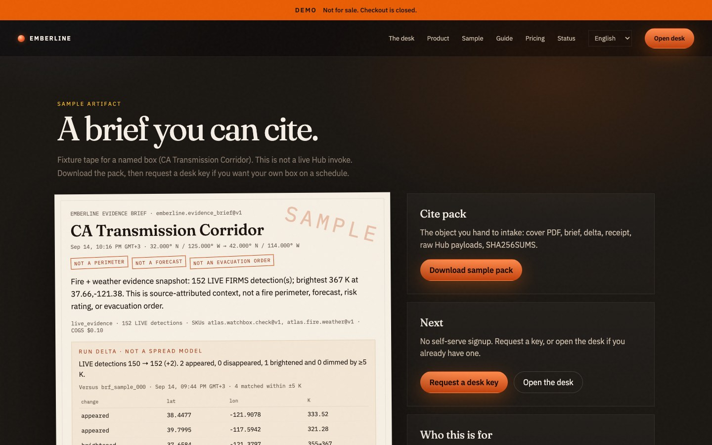
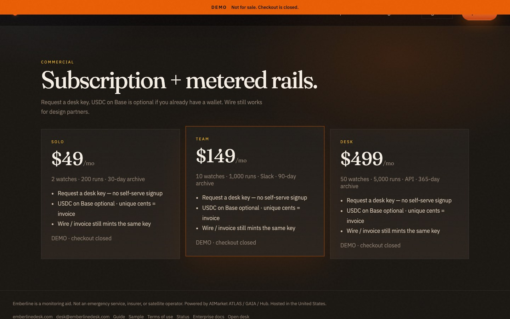

# Emberline

<p align="center">
  <strong>EMBERLINE</strong> — Fire Evidence Desk<br/>
  Independent B2B product on AIMarket rails · part of <a href="https://github.com/alexar76">alexar76</a> · <strong>not</strong> an AIMarket brand
</p>

<p align="center">
  <a href="https://emberlinedesk.com/">
    
  </a>
  <br>
  <sub>Detections you can cite — not perimeters we invent. — <a href="https://emberlinedesk.com/"><b>live demo →</b></a></sub>
</p>

<p align="center">
  <a href="https://emberlinedesk.com/sample"></a>
  <a href="https://emberlinedesk.com/#pricing"></a>
</p>

**Fire Evidence Desk.** Independent B2B monitoring for the box you watch.

[](.github/workflows/ci.yml)
[](LICENSE)
[](docker-compose.yml)

> Detections you can cite — not perimeters we invent.

Emberline is a third-party product on the AIMarket rails. It is **not** an AIMarket brand surface, not a forecast SaaS, and not an insurer. Public site: [https://emberlinedesk.com](https://emberlinedesk.com). Sample brief: [/sample](https://emberlinedesk.com/sample). Press kit: [/press](https://emberlinedesk.com/press). On a schedule it buys attested `atlas.watchbox.check@v1` / `atlas.fire.weather@v1` artifacts, normalizes a brief, stores an immutable archive, and optionally alerts Slack or an HMAC webhook.

Family tree: [`cite-desks/`](../) — Emberline is the fire desk. Flood / PV / maritime are **separate products**, not `*.emberlinedesk.com` subdomains. Smoke is an optional **layer** on this desk (HMS qualitative NA polygon), not a subdomain.

## Why this exists

Wildfire dashboards quietly upgrade NASA FIRMS thermal **points** into a red polygon. That polygon does not survive audit, intake, or a newsroom fight. Emberline keeps the points, pairs bounded LIVE weather, prints limitations on the artifact, and files the receipt.

| We sell | We refuse |
|---|---|
| Named geozone watches | Fire perimeters / containment |
| Evidence briefs + JSON | Forecasts and spread models |
| Signed receipts + archive | Risk scores 0–100 |
| Slack / webhook / PWA push | Evacuation orders |
| Fail-closed LIVE vs SIM | “Detect every fire in N minutes” |

## Quick start (Docker)

```bash
make up
# production overlay (requires JWT_SECRET, POSTGRES_PASSWORD, PAY_MINT_SECRET,
# and either HUB_API_KEY or a complete HUB_PAYMENT_CHANNEL pair):
# docker compose -f docker-compose.yml -f docker-compose.prod.yml up --build -d
```

Open [http://localhost:8080](http://localhost:8080) locally. Production origin is [https://emberlinedesk.com](https://emberlinedesk.com).

| | |
|---|---|
| Demo login (development seed only) | `owner@emberlinedesk.com` / `emberline-demo` |
| Sample watch | CA Transmission Corridor |
| Default rails | **fixture** mode (signed snapshot, no Hub key required) |

Live Hub mode:

```bash
HUB_MODE=live HUB_PAYMENT_CHANNEL=... HUB_PAYMENT_CHANNEL_SECRET=... docker compose up --build
```

## Local development

```bash
# API
cd backend
python -m venv .venv && source .venv/bin/activate
pip install -e ".[dev]"
export DATABASE_URL=sqlite:///./emberline.db HUB_MODE=fixture SEED_DEMO=true
uvicorn app.main:app --reload --port 8000

# Web
cd frontend
npm install
npm run dev
```

Web Vite proxies `/api` to `localhost:8000`. Marketing site: `http://localhost:5173`.

## Tests

```bash
make test
# or
cd backend && pytest
cd frontend && npm test && npm run build
```

The suite pins the product discipline:

- SIM detections never appear on a LIVE brief
- empty LIVE → `no_live_evidence` (fail-closed)
- every brief carries **NOT A PERIMETER / NOT A FORECAST / NOT AN EVACUATION ORDER**
- bbox validation rejects inverted and oversized boxes
- webhook HMAC is stable

## Architecture

```
User → Emberline web (nginx)
         └─ /api → FastAPI
                    ├─ Watch scheduler
                    ├─ Policy engine (on_match | always_brief)
                    ├─ Hub client (fixture | live)
                    │     ├─ atlas.watchbox.check@v1   ~ $0.02
                    │     └─ atlas.fire.weather@v1     ~ $0.08
                    ├─ Brief builder (fail-closed)
                    ├─ Postgres archive
                    └─ Delivery (Slack / HMAC webhook)
```

Money: customer → USDC on Base (or wire mint) → desk key → Emberline → AIMarket Hub. Margin is the desk — schedule, fail-closed brief, archive — not invented geometry.

**Beyond ATLAS:** Hub sells a snapshot. Emberline sells the watch, the citeable tape, receipt verification, constrained delivery, and the commercial envelope so analysts do not each hold a Hub key. See [docs/enterprise/VALUE.md](docs/enterprise/VALUE.md).

## Enterprise documentation

Implementation, usage, API, and operations: [docs/enterprise/](docs/enterprise/README.md). Online user guide (en/es/fr): [/guide](https://emberlinedesk.com/guide). Host: **USA**. Languages and NL/US placement for the family: [cite-desks/docs/LOCALES-AND-PLACEMENT.md](../docs/LOCALES-AND-PLACEMENT.md). A browsable enterprise copy is served at `/docs/enterprise/` on the web image.

## Product objects

| Object | Meaning |
|---|---|
| Workspace | Org, plan, members |
| Watch | Named bbox, cadence, alert thresholds |
| Run | One Hub-backed tick |
| Brief | Human report + machine JSON |
| Receipt | Digest / signature panel from ATLAS |
| Archive | Immutable run tape |

## Plans (illustration)

| Plan | Price | Included |
|---|---|---|
| Solo | $49/mo | 2 watches · 200 runs · 30d |
| Team | $149/mo | 10 watches · 1,000 runs · Slack · 90d |
| Desk | $499/mo | 50 watches · 5,000 runs · API · 365d |

Overage: `$0.12` / `fire.weather`, `$0.04` / `watchbox`. Tune after design partners.

## Status copy

Powered by AIMarket ATLAS / GAIA. Emberline does not operate satellites.

## License

Earth texture on the marketing globe is NASA Blue Marble (public domain), bundled from the [three-globe](https://github.com/vasturiano/three-globe) example assets.

MIT. See [LICENSE](LICENSE). Contributions: [CONTRIBUTING.md](CONTRIBUTING.md). Security: [SECURITY.md](SECURITY.md).
