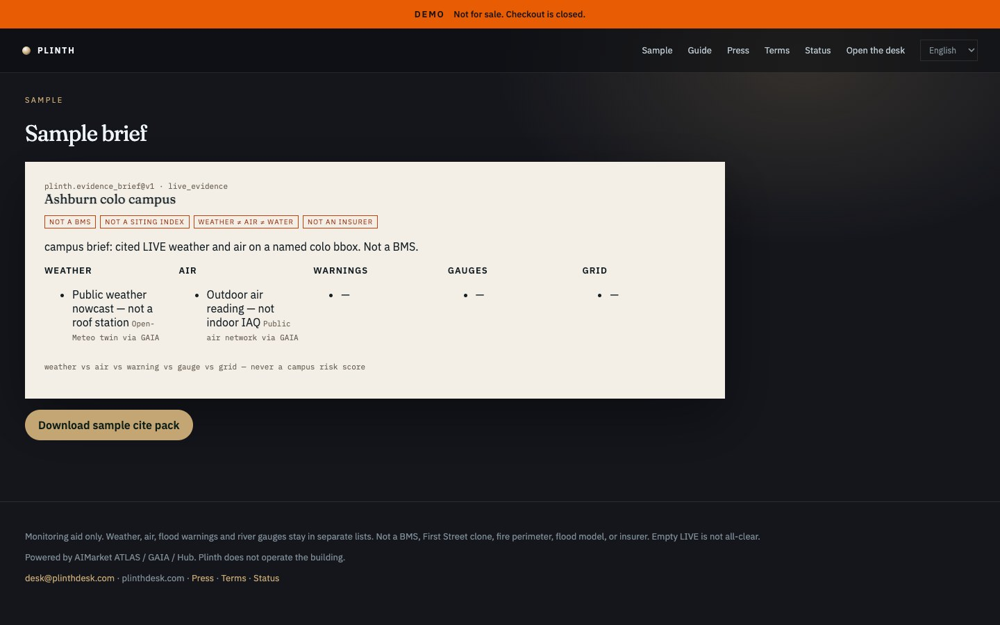

# Plinth — Site Evidence Desk

<p align="center">
  <strong>PLINTH</strong> — Site Evidence Desk<br/>
  Independent B2B product on AIMarket rails · part of <a href="https://github.com/alexar76">alexar76</a> · <strong>not</strong> an AIMarket brand
</p>

<p align="center">
  <a href="https://plinth.modelmarket.dev/">
    
  </a>
  <br>
  <sub>Weather, air, water, grid as separate lists. Not a BMS. — <a href="https://plinth.modelmarket.dev/"><b>live demo →</b></a></sub>
</p>

<p align="center">
  <a href="https://plinth.modelmarket.dev/sample"></a>
</p>

Independent B2B monitoring for a **named building, campus, or colo bbox**. **Not** Emberline, not an AIMarket brand surface, not a BMS.

Live origin (intended): [https://plinthdesk.com](https://plinthdesk.com)

On a schedule it buys `atlas.watchbox.check@v1` and `atlas.situation.brief@v1` with ATLAS preset **`campus`**, then files a cite pack that keeps **weather, air, flood warnings, river gauges, and grid in separate lists**. Never a campus risk score.

| We sell | We refuse |
|---|---|
| Named campus / colo bbox (max 1° × 1°) | BMS / indoor IAQ |
| Weather, air, water, grid as separate lists | First Street 50-year index |
| Cite pack + receipts | Fire perimeter |
| Slack / HMAC webhook | Campus risk score / insurer |

Prepaid access is self-serve: a plan quotes a unique USDC amount on Base, the settlement
poll issues a `pln_` desk key, and the invoice page redeems it. No person in the loop —
[`docs/GUIDE.md`](docs/GUIDE.md#buy-access). In production the desk refuses to boot without
a real `PAY_BASE_ADDRESS`.

Demo login (fixture): `owner@plinthdesk.com` / `plinth-demo`

```bash
cd cite-desks/plinth
docker compose up --build
# http://localhost:8094
```

Kernel tests cover the campus split. Family deploy: `cite-desks/deploy.sh plinth`.

## Source (like Emberline’s folders — shared, not copied)

| Role | Emberline (own tree) | Plinth (shared kernel) |
|------|----------------------|------------------------|
| Site markup / CSS / JS | `emberline/frontend/` | [`kernel/web/`](../kernel/web/) — see [`frontend/`](frontend/) |
| Python FastAPI | `emberline/backend/` | [`kernel/desk_kernel/`](../kernel/desk_kernel/) — see [`backend/`](backend/) |

This folder is brand + compose + `DESK_ID=plinth`. Runnable HTML/CSS/JS and the API live under [`../kernel/`](../kernel/).

Languages: English, Español, Deutsch. Guide: `/guide`. Host: **USA** — see [`docs/LOCALES-AND-PLACEMENT.md`](../docs/LOCALES-AND-PLACEMENT.md).

Do not put Plinth under `*.emberlinedesk.com`. Do not send `layers` with the campus preset.
