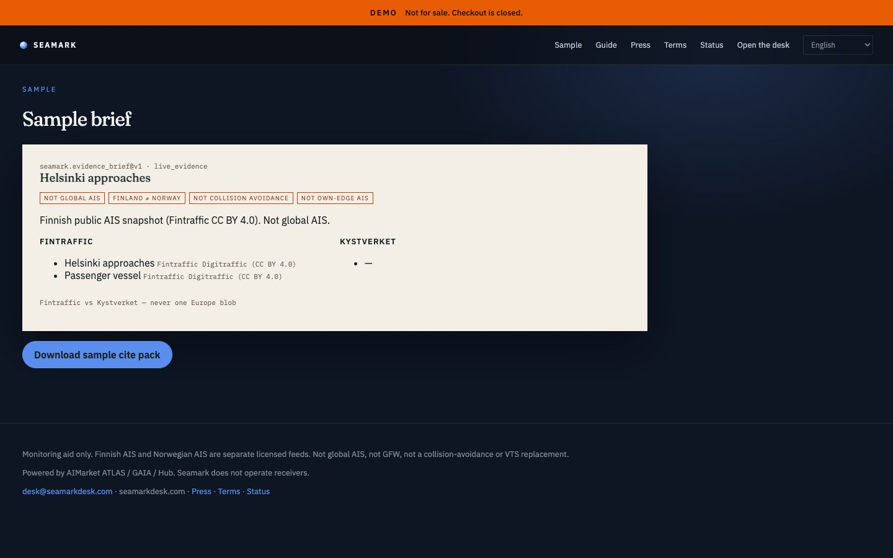

# Seamark — Nordic Maritime Desk

<p align="center">
  <strong>SEAMARK</strong> — Nordic Maritime Desk<br/>
  Independent B2B product on AIMarket rails · part of <a href="https://github.com/alexar76">alexar76</a> · <strong>not</strong> an AIMarket brand
</p>

<p align="center">
  <a href="https://seamark.modelmarket.dev/">
    
  </a>
  <br>
  <sub>Fintraffic and Kystverket stay two lists. Not global AIS. — <a href="https://seamark.modelmarket.dev/"><b>live demo →</b></a></sub>
</p>

<p align="center">
  <a href="https://seamark.modelmarket.dev/sample"></a>
</p>

Independent B2B monitoring for a named box in **Finnish and/or Norwegian waters**. Not Emberline, not global AIS, not GFW.

Live origin (intended): [https://seamarkdesk.com](https://seamarkdesk.com)

Buys `atlas.watchbox.check@v1` then `gaia.ais.public.read@v1`. Fintraffic (CC BY 4.0) and Kystverket (NLOD 2.0) stay in **two lists**.

A bbox outside those licensed envelopes is refused.

| We sell | We refuse |
|---|---|
| Named coastal box | Global AIS |
| FI list + NO list | Merging into one Europe blob |
| Cite pack + receipts | Collision avoidance / VTS |

Prepaid access is self-serve: a plan quotes a unique USDC amount on Base, the settlement
poll issues a `smk_` desk key, and the invoice page redeems it. No person in the loop —
[`docs/GUIDE.md`](docs/GUIDE.md#buy-access). In production the desk refuses to boot without
a real `PAY_BASE_ADDRESS`.

Demo: `owner@seamarkdesk.com` / `seamark-demo`

```bash
cd cite-desks/seamark
docker compose up --build
# http://localhost:8093
```

Languages: English, suomi, norsk bokmål (not Swedish — licensed waters are FI/NO). Guide: `/guide`. Host: **Netherlands**. See [`docs/LOCALES-AND-PLACEMENT.md`](../docs/LOCALES-AND-PLACEMENT.md).

## Source (like Emberline’s folders — shared, not copied)

| Role | Emberline (own tree) | Seamark (shared kernel) |
|------|----------------------|-------------------------|
| Site markup / CSS / JS | `emberline/frontend/` | [`kernel/web/`](../kernel/web/) — see [`frontend/`](frontend/) |
| Python FastAPI | `emberline/backend/` | [`kernel/desk_kernel/`](../kernel/desk_kernel/) — see [`backend/`](backend/) |

This folder is brand + compose + `DESK_ID=seamark`. The public shell is shared `kernel/web`. Emberline keeps its own React globe.
