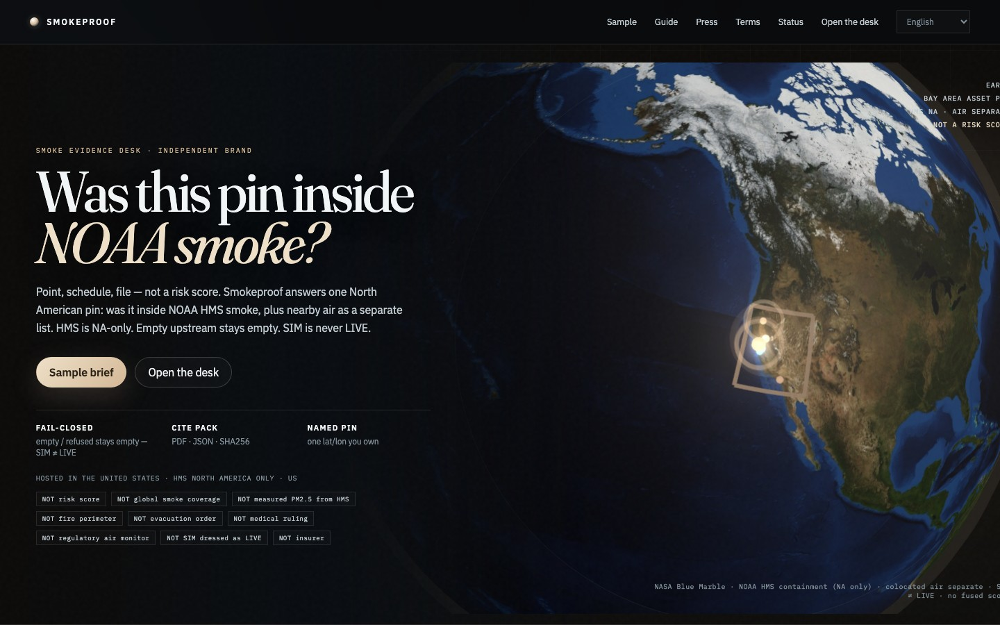
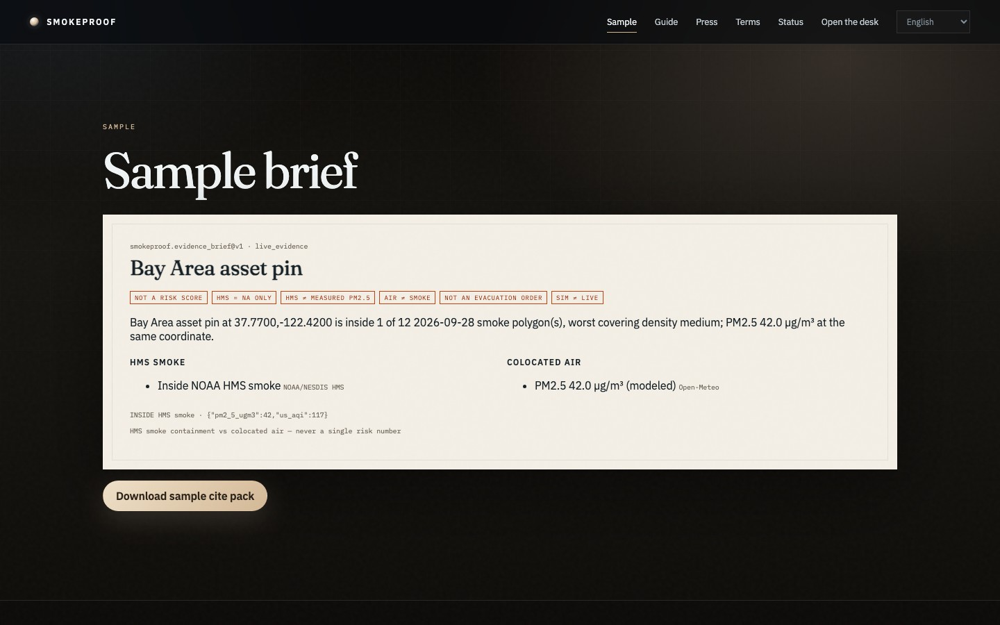

# Smokeproof — Smoke Evidence Desk

<p align="center">
  <strong>SMOKEPROOF</strong> — Smoke Evidence Desk<br/>
  Independent B2B product on AIMarket rails · part of <a href="https://github.com/alexar76">alexar76</a> · <strong>not</strong> an AIMarket brand
</p>

<p align="center">
  <a href="https://smokeproof.modelmarket.dev/">
    
  </a>
  <br>
  <sub>Was this pin inside NOAA HMS smoke? Plus colocated air. Not a risk score. — <a href="https://smokeproof.modelmarket.dev/"><b>live demo →</b></a></sub>
</p>

<p align="center">
  <a href="https://smokeproof.modelmarket.dev/sample"></a>
</p>

Independent B2B monitoring for one **North American asset pin**. Same core as siblings: **point · schedule · file**. **Not** a risk score, **not** Emberline’s optional smoke layer, **not** a fused AQI product.

Live origin (intended): [https://smokeproofdesk.com](https://smokeproofdesk.com)

Cadence is **15 / 30 / 60 minutes**. The watch is a **point**, not a box. It buys `atlas.smoke.operations@v1` and files a cite pack that keeps **HMS containment and colocated air in two lists**. Never a single risk number.

### Limits (on the desk site)

| Limit | Honesty |
|---|---|
| Geography | NOAA HMS is **North America only** — never imply global smoke |
| HMS density | Qualitative polygon — **not** measured PM2.5, **not** a fire perimeter |
| Nearby air | Separate list; modeled **Open-Meteo** at the coordinate — **not** a regulatory station |
| Empty / fail | Upstream empty or refuse stays empty / offline — **no invented readings**; **SIM ≠ LIVE** |
| Score | Containment + air are **never** fused into a risk number |

| We sell | We refuse |
|---|---|
| Named NA asset pin | A single smoke-risk score |
| Exact HMS point-in-polygon | Global smoke coverage |
| Nearby air as a separate list | Treating HMS as measured PM2.5 |
| Cite pack + receipts | Inventing readings / dressing SIM as LIVE |

Prepaid access is self-serve: a plan quotes a unique USDC amount on Base, the settlement
poll issues a `smp_` desk key, and the invoice page redeems it. No person in the loop —
[`docs/GUIDE.md`](docs/GUIDE.md#buy-access). In production the desk refuses to boot without
a real `PAY_BASE_ADDRESS`.

Demo: `owner@smokeproofdesk.com` / `smokeproof-demo`

```bash
cd cite-desks/smokeproof
docker compose up --build
# http://localhost:8095
```

Languages: English, Español, Français. Guide: `/guide`. Host: **USA** — NOAA HMS is North America–only. See [`docs/LOCALES-AND-PLACEMENT.md`](../docs/LOCALES-AND-PLACEMENT.md).

## Source (like Emberline’s folders — shared, not copied)

| Role | Emberline (own tree) | Smokeproof (shared kernel) |
|------|----------------------|----------------------------|
| Site markup / CSS / JS | `emberline/frontend/` | [`kernel/web/`](../kernel/web/) — see [`frontend/`](frontend/) |
| Python FastAPI | `emberline/backend/` | [`kernel/desk_kernel/`](../kernel/desk_kernel/) — see [`backend/`](backend/) |

This folder is brand + compose + `DESK_ID=smokeproof`. The public shell is shared `kernel/web`. Emberline keeps its own React globe; Smokeproof is a peer desk, not a subdomain of Emberline.
