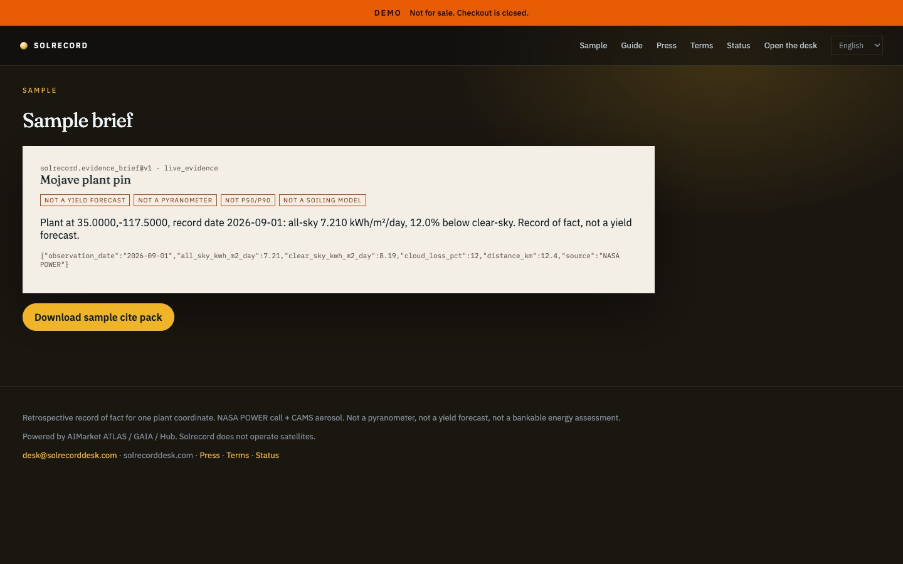

# Solrecord — PV Evidence Desk

<p align="center">
  <strong>SOLRECORD</strong> — PV Evidence Desk<br/>
  Independent B2B product on AIMarket rails · part of <a href="https://github.com/alexar76">alexar76</a> · <strong>not</strong> an AIMarket brand
</p>

<p align="center">
  <a href="https://solrecord.modelmarket.dev/">
    
  </a>
  <br>
  <sub>Retrospective irradiance at a plant pin. Not a yield forecast. — <a href="https://solrecord.modelmarket.dev/"><b>live demo →</b></a></sub>
</p>

<p align="center">
  <a href="https://solrecord.modelmarket.dev/sample"></a>
</p>

Independent B2B monitoring for one plant coordinate. **Not** Emberline, not a yield SaaS.

Live origin (intended): [https://solrecorddesk.com](https://solrecorddesk.com)

Cadence is **daily** (`1d`, optional `12h`). The watch is a **point**, not a box. It buys `atlas.pv.irradiance.record@v1` and files a cite pack: NASA POWER all-sky vs clear-sky + CAMS aerosol.

| We sell | We refuse |
|---|---|
| Named plant pin | Yield forecast |
| Retrospective record of fact | Pyranometer claim |
| Cite pack + receipts | P50/P90 bankable assessment |

Prepaid access is self-serve: a plan quotes a unique USDC amount on Base, the settlement
poll issues a `sol_` desk key, and the invoice page redeems it. No person in the loop —
[`docs/GUIDE.md`](docs/GUIDE.md#buy-access). In production the desk refuses to boot without
a real `PAY_BASE_ADDRESS`.

Demo: `owner@solrecorddesk.com` / `solrecord-demo`

```bash
cd cite-desks/solrecord
docker compose up --build
# http://localhost:8092
```

Languages: English, Español, Deutsch. Guide: `/guide`. Host: **USA** — NASA POWER. See [`docs/LOCALES-AND-PLACEMENT.md`](../docs/LOCALES-AND-PLACEMENT.md).

## Source (like Emberline’s folders — shared, not copied)

| Role | Emberline (own tree) | Solrecord (shared kernel) |
|------|----------------------|---------------------------|
| Site markup / CSS / JS | `emberline/frontend/` | [`kernel/web/`](../kernel/web/) — see [`frontend/`](frontend/) |
| Python FastAPI | `emberline/backend/` | [`kernel/desk_kernel/`](../kernel/desk_kernel/) — see [`backend/`](backend/) |

This folder is brand + compose + `DESK_ID=solrecord`. The public shell is shared `kernel/web`. Emberline keeps its own React globe.
