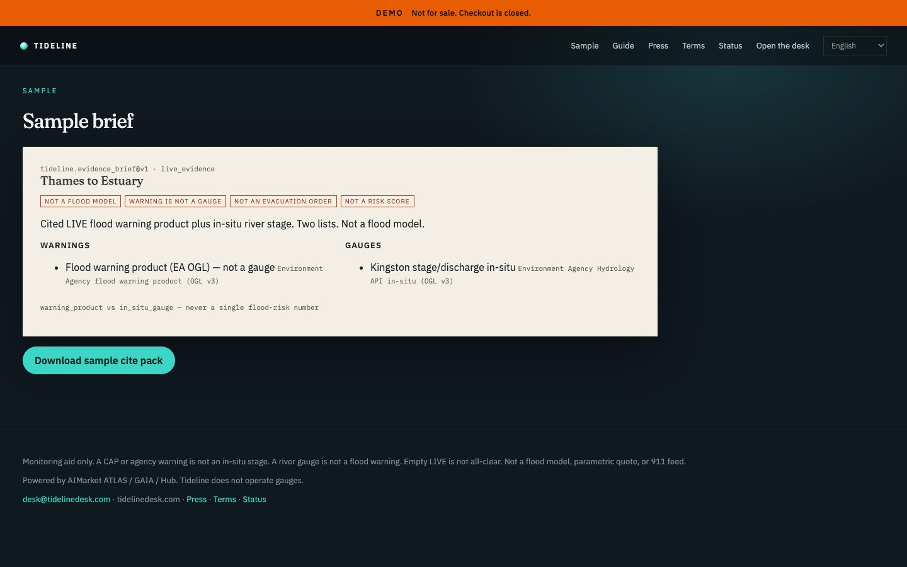

# Tideline — Flood Evidence Desk

<p align="center">
  <strong>TIDELINE</strong> — Flood Evidence Desk<br/>
  Independent B2B product on AIMarket rails · part of <a href="https://github.com/alexar76">alexar76</a> · <strong>not</strong> an AIMarket brand
</p>

<p align="center">
  <a href="https://tideline.modelmarket.dev/">
    
  </a>
  <br>
  <sub>CAP warning and in-situ gauge stay two lists. Not a flood model. — <a href="https://tideline.modelmarket.dev/"><b>live demo →</b></a></sub>
</p>

<p align="center">
  <a href="https://tideline.modelmarket.dev/sample"></a>
</p>

Independent B2B monitoring for a named basin. **Not** Emberline, not an AIMarket brand surface, not Floodbase.

Live origin (intended): [https://tidelinedesk.com](https://tidelinedesk.com)

On a schedule it buys `atlas.watchbox.check@v1` and `atlas.situation.brief@v1` (flood + river layers), then files a cite pack that keeps **warning products and in-situ gauges in two lists**.

| We sell | We refuse |
|---|---|
| Named geozone watches | A single flood-risk number |
| Warning list + gauge list | Floodbase / 50-year index |
| Cite pack + receipts | Evacuation / all-clear |
| Slack / HMAC webhook | Merging CAP with Kingston stage |

Prepaid access is self-serve: a plan quotes a unique USDC amount on Base, the settlement
poll issues a `tdl_` desk key, and the invoice page redeems it. No person in the loop —
[`docs/GUIDE.md`](docs/GUIDE.md#buy-access). In production the desk refuses to boot without
a real `PAY_BASE_ADDRESS`.

Demo login (fixture): `owner@tidelinedesk.com` / `tideline-demo`

```bash
cd cite-desks/tideline
docker compose up --build
# http://localhost:8091
```

Kernel tests cover the claim split. Family deploy: `cite-desks/deploy.sh tideline`.

Languages: English, Nederlands, Français, Deutsch. Guide: `/guide`. Host: **Netherlands** — see [`docs/LOCALES-AND-PLACEMENT.md`](../docs/LOCALES-AND-PLACEMENT.md).

## Source (like Emberline’s folders — shared, not copied)

| Role | Emberline (own tree) | Tideline (shared kernel) |
|------|----------------------|--------------------------|
| Site markup / CSS / JS | `emberline/frontend/` | [`kernel/web/`](../kernel/web/) — see [`frontend/`](frontend/) |
| Python FastAPI | `emberline/backend/` | [`kernel/desk_kernel/`](../kernel/desk_kernel/) — see [`backend/`](backend/) |

This folder is brand + compose + `DESK_ID=tideline`. The public shell is shared `kernel/web` (`/sample` `/press` `/legal` `/status`). Emberline keeps its own React globe.
